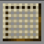

# Sifter Meshes

    

    

    

    

    Such a variety of materials requires a variety of specialized crafters, and the knowledge to use them.

 

MineColonies adds 4 Meshes, used by the [Sifter](../../source/workers/sifter). The Sifter will automatically unlock these recipes for your colony once the requirements are met. More advanced meshes last longer, and can sift out materials earlier meshes would have missed.

| Mesh    | Requires             | Crafter | Cost |
| ------- | -------------------- | ------- | ---- |
| String  | Sifter at least level 1 | Fletcher | 1 String |
| Flint   | Sifter at least level 3 | Stonemason | 1 Flint |
| Iron    | Sifter at least level 4 | Blacksmith | 1 Iron  |
| Diamond | Sifter at least level 5 | Mechanic   | 1 Diamond |