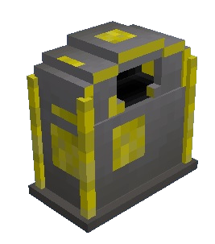

# Stash

    

    <recipe>stash</recipe>

 

The stash lets a player deposit items that they want to be picked up by a [Courier](../../source/workers/forester) to take to the [Warehouse](../../source/workers/teacher).

The stash can be crafted at the [Sawmill](../../source/buildings/sawmill) or by the player.
 

## Using the Stash

To use the stash, right-click on it to bring up the inventory, which works like a chest. Put items in the stash and a Courier will pick them up.
