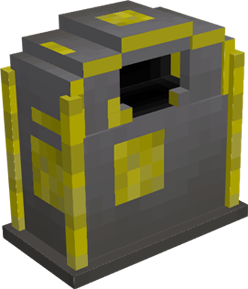

# Stash

    

    <recipe>stashbox</recipe>

 

## The Block

The Stash lets the player deposit items that they want to be picked up by a [Deliveryman](../../source/workers/deliveryman) to take to the [Warehouse](../../source/buildings/warehouse).

 

## The Use

To use the Stash, right-click on it to bring up the inventory, which works just like a chest. Put items in the Stash and a Deliveryman will pick them up.
