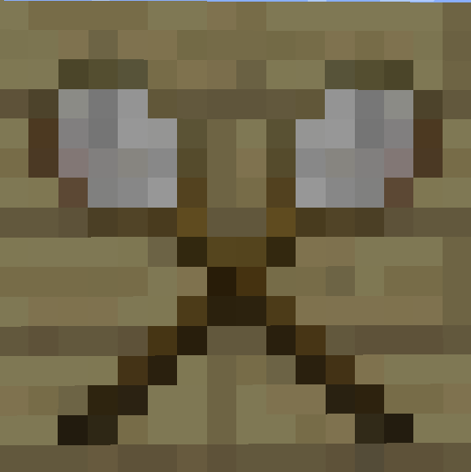
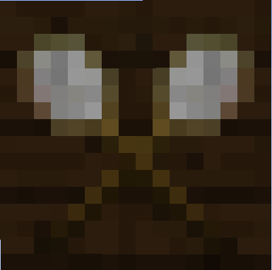
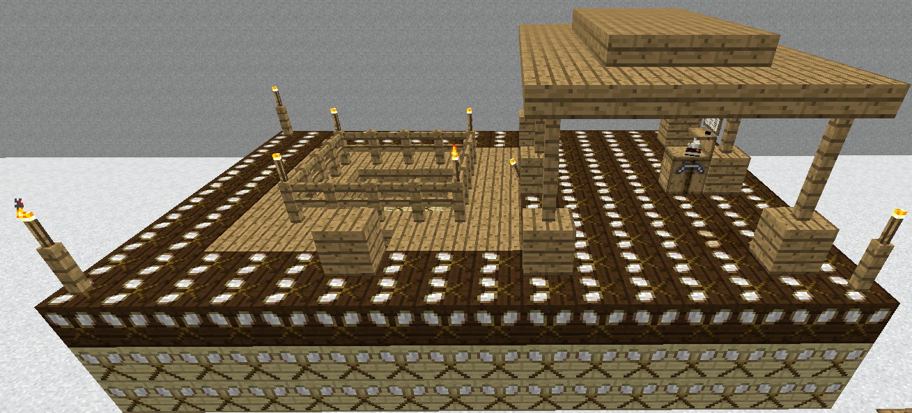

# Substitution Blocks

    

    

    <recipe>substitutionblock</recipe> - <recipe>solidsubblock</recipe>

The substitution blocks (also called placeholder blocks) are tan and brown. The tan block is the substitution block, and the brown is the solid substitution block. Each serves its own function. 

## Using the Substitution Blocks

The substitution block tells the mod to leave any blocks that are currently in that spot alone. It will not remove or change anything that already exists in that spot.

The solid substitution block tells the mod to replace any non-solid blocks (air, grass, leaves, etc.) with the biome's regular ground block (grass, sandstone, red sandstone, white terracotta, etc). 

You can make and use these blocks in survival, but they are mainly used to scan schematics.

Here's an example:
 

 
