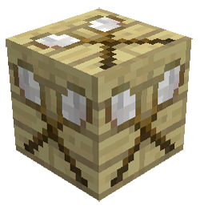

# Substitution Blocks

## Welcome to the Substitution Blocks page. 

    

    

    <recipe>substitutionblock</recipe> - <recipe>solidsubstitutionblock</recipe>

### The Blocks

The Substitution Blocks are tan and brown. The tan block is the substitution block, and the brown is the solid substitution block.  Each servers its own function. 

The substitution block, tells the mod, to leave any blocks, that are currently in that spot, alone. It will not remove or change anything that already exists in that spot.

The solid substitution block, tells the mod, to replace any non-solid blocks (air, grass, leaves, etc.) with the biome's regular ground block (dirt, sandstone, redsandstone, white terracotta. 

You can make and use these blocks in survival, but they are used for builders to scan schematics.
 

 
