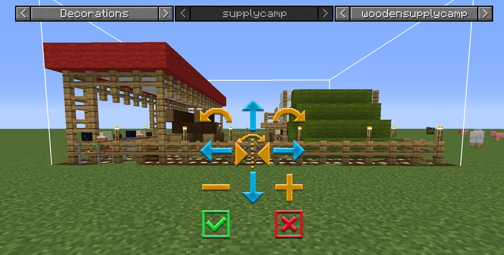
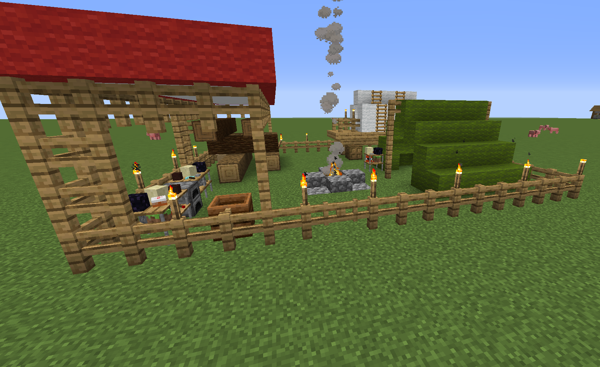
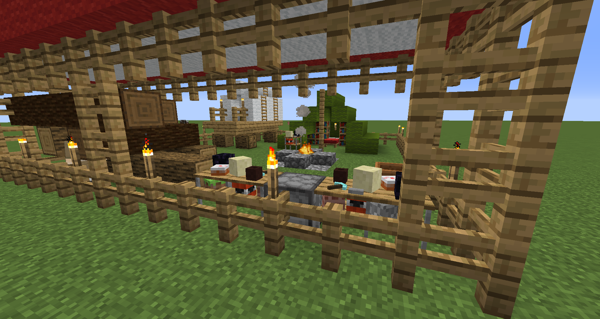

# Supply Camp

## Welcome to the Supply Camp page. 

    <recipe>supplycamp</recipe>

 
The Supply Camp is one of the two options to to start playing Minecolonies. The first step is to craft the Supply Camp block. 

The Suppy Camp is one of the *ONLY* two ways to obtain the Town Hall block so you can start building your very own Town. It is a great supply of materials for you to get started as well as a very illuminated and safe place to live while you get your Town started. It will take a bit of time to get the needed resources to start building so it can also serve as a great base for you while you plan where your buildings will go and gather what you need. You have many chests, bed, bookshelves, torches, wool, etc etc. What else could the Camp contain... _hhmmmm maybe some **treasure** as well?_
 
## Placement of the Supply Camp

When you place the Supply Camp it will spawn a chest that will contain the [Town Hall](../buildings/townhall) block and the [Building Tool](../items/buildingtool). To place the Supply Camp, you need to have a large enough flat, clear piece of land. The recommended flat piece of land must be at least 17 x 17 blocks in size. You can make and use the Building Tool to place the Supply Camp so you can see a 3D image and you can move it around to the exact place and orientation you want it. But please take into account the Town Hall placement as well before you place your Supply Camp. *Once the Supply camp is placed, you can't place another Camp or Ship in this World anymore.*

    
You can use the placement GUI, to get the placement just right. There are also, a variety of camps to choose from, based on the style you want. You can choose the style from the 3rd drop down. 

You can use the arrow buttons in the center to change the location, the curved arrows to rotate the camp. 
    
- **Hint:** if you’re not able to place the Supply Camp, try it block by block: one to the right, or the left, closer of further from the area you cleared. It can not contain any holes or have any flowers, grass, ferns, etc. It must be completely flat and clear. If you can not place the camp, enlarge the area outside the outline of the camp by one or two blocks around the parameter. 

       

**Here are some screenshots for your viewing pleasure:**

  
  
