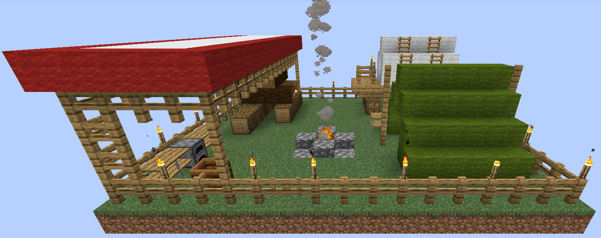

# Supply Camp and Ship

    <recipe>supplycamp</recipe> 
    <recipe>supplyship</recipe>

 

The Supply Camp or the Supply Ship is how you begin a colony. 

The Suppy Camp or Supply Ship is the *ONLY* way to obtain the Town Hall block so you can start building your colony. Each option gives you a great supply of materials for you to get started as well as a very illuminated and safe place to live while you get your colony started. There are a variety of items, and they may change depending on the style you choose to use. Many also have some treasure hidden in them!

## Placement of the Supply Camp or Supply Ship

Before you place the Supply Camp, you need to have a large enough flat, clear piece of land that is as large as the camp area. For the Supply Ship, you need an area of water at least one block larger than the build area. Not all Camps or Ships are the same size.

To place either Camp or Ship, simply right-click on a block and the 3D preview of the Camp and Ship will be displayed, with the GUI to move it around. You will see a white outline of the entire build, which is the area that needs to be cleared. If you need to look around the area before accepting the build, press ESC to exit the GUI. This will leave the preview up so you can still see it. To re-enter the GUI, simply click the Camp or Ship on the ground again to bring it up.

  

 
 
    

There are also a variety of camps to choose from, based on the style you want. You can choose the style from the 3rd drop down. You can use the arrow buttons in the center to change the location and the curved arrows to rotate the camp. Once you have it where you want it, press the green check, and the Camp or Ship will be placed. 

 

*Once the Supply Camp or Ship is placed, you can't place another Camp or Ship in this world anymore, unless you find one in a treasure chest.*

 

**Hint:** If you’re not able to place the Supply Camp or Ship, try it block by block: one to the right, or the left, closer or further from the area you cleared. The area cannot contain any holes or have any flowers, grass, ferns, seaweed, etc. It must be completely flat and clear. If you can not place the camp, enlarge the area outside the outline of the camp by one or two blocks around the perimeter. 

 

**Note:** You can place Camps and Ships in the Nether, but placing a Ship there requires lava instead of water.
 
 

**Here are some screenshots:**

  
  
  

    

  
  
 

