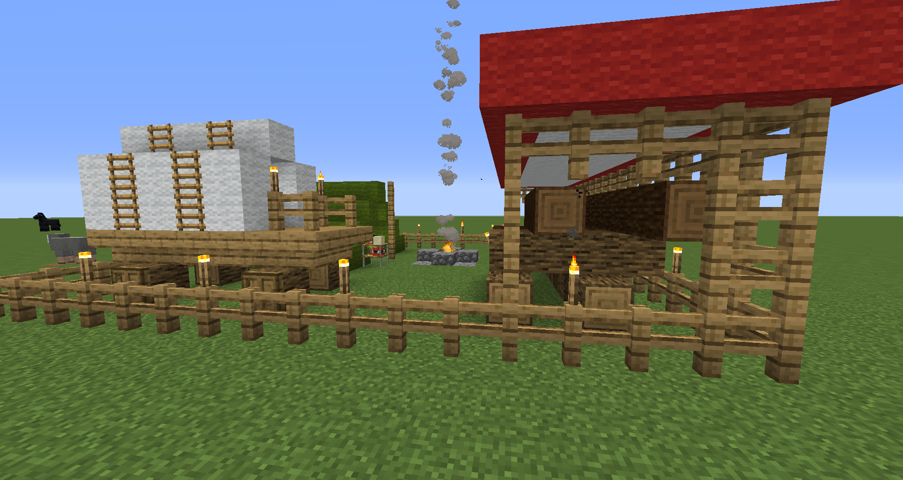

# Supply Camp and Supply Ship

    <recipe>supplycamp</recipe>

 
The Supply Camp is one of two options to to start playing Minecolonies (the other is the Supply Ship). The first step is to craft the Supply Camp or Supply Ship block. 

The Suppy Camp or Supply Ship is the *ONLY* way to obtain the Town Hall block so you can start building your colony. It has a great supply of materials for you to get started as well as a very illuminated and safe place to live while you get your Town started. There are many chests, a bed, bookshelves, torches, wool, food, dispensers (in the Supply Ship), glowstone (in the Supply Ship), and the [Building Tool](../items/buildingtool), and possibly some treasure in it. 

## Placement of the Supply Camp or Supply Ship

To place the Supply Camp, you need to have a large enough flat, clear piece of land that is at least 17x17 blocks. For the Supply Ship, you need an area of water at least 32x20 blocks big. You can make and use the Building Tool (before you get it from the Camp or Ship) to place the Camp or Ship. This way, you can see a 3D image and can move it around to the exact place and orientation you want it. *Once the Supply Camp or Ship is placed, you can't place another Camp or Ship in this colony anymore.*

    

    
    
You can use the placement GUI to get the placement just right. There are also a variety of camps to choose from, based on the style you want. You can choose the style from the 3rd drop down. 

You can use the arrow buttons in the center to change the location and the curved arrows to rotate the camp. 
    
- **Hint:** If you’re not able to place the Supply Camp or Ship, try it block by block: one to the right, or the left, closer of further from the area you cleared. It can not contain any holes or have any flowers, grass, ferns, seaweed, etc. It must be completely flat and clear. If you can not place the camp, enlarge the area outside the outline of the camp by one or two blocks around the parameter. 

**Here are some screenshots:**

  
  
  

    

  
  
 

