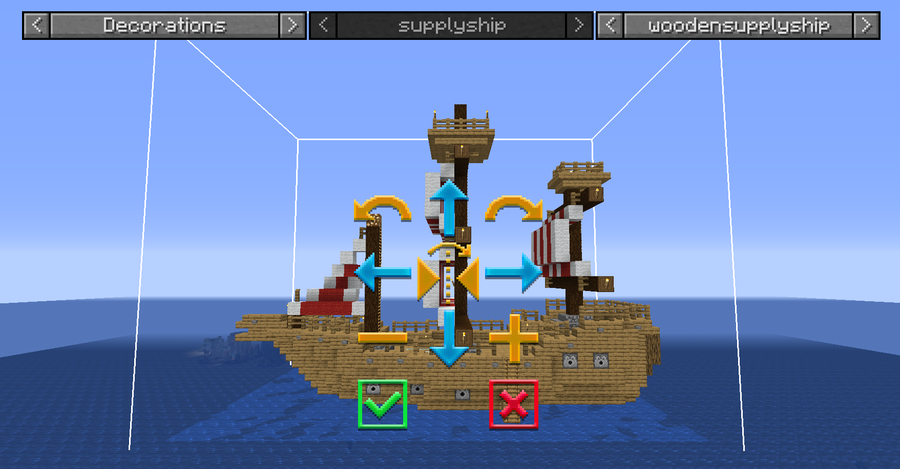
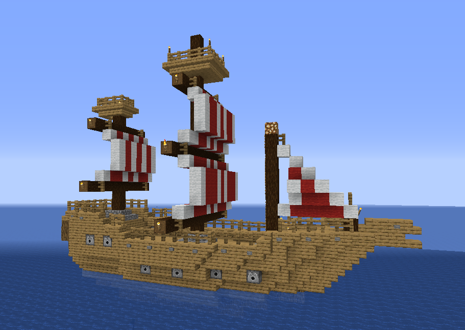

# Supply Ship

    <recipe>supplyship</recipe>

 
The Supply Ship is one of the two options to to start playing Minecolonies. The first step is to craft the Supply Ship block.

The Supply Ship is one of the *ONLY* two ways to obtain the Town Hall block so you can start building your very own Town. It is a great supply of materials for you to get started as well as a very illuminated and safe place to live while you get your Town started. It will take a bit of time to get the needed resources to start building so it can also serve as a great base for you while you plan where your buildings will go and gather what you need. You have many chests, beds, bookshelves, torches, dispensers, wool, glowstone, etc etc. What else could the Ship contain... _hhmmmm maybe some **treasure** as well?_
  

## Placement of the Supply Ship.

When you place the Supply Ship it will spawn a chest that will contain the [Town Hall](../buildings/townhall) block and the [Building Tool](../items/buildingtool). To place the Supply Ship, you need to have a large enough body of water. The Supply Ship is 32 x 11 blocks in length and width. So the recommended body of water must be at least (32 x 20). You can make and use the Building Tool to place the Supply Camp so you can see a 3D image and you can move it around to the exact place and orientation you want it. If you place it manually, when you place the Supply Ship a chest will appear on the exact block you right clicked the supply Ship block. The Chest will be directly in front of the ladder to board the Supply Ship (8 blocks from the boarding ladder) and the ladder is not in the middle of the Supply Ship. But please take into account the Town Hall placement as well before you place your Supply Ship. *Once the Supply Ship is placed, you can't place another Ship or Camp in this World anymore.*
  

    
You can use the placement GUI, to get the placement just right. There are also, a variety of ships to choose from, based on the style you want. You can choose the style from the 3rd drop down. 

- **Hint:** If you are not using the building tool and are placing the supply ship block manually (right clicking the floor with it) and it won't place you will have to move left/right and even make a walkway into the water. Try 1 block at a time until you an successfully place it.
  

**Here are some screenshots for your viewing pleasure:**

  

  

 

