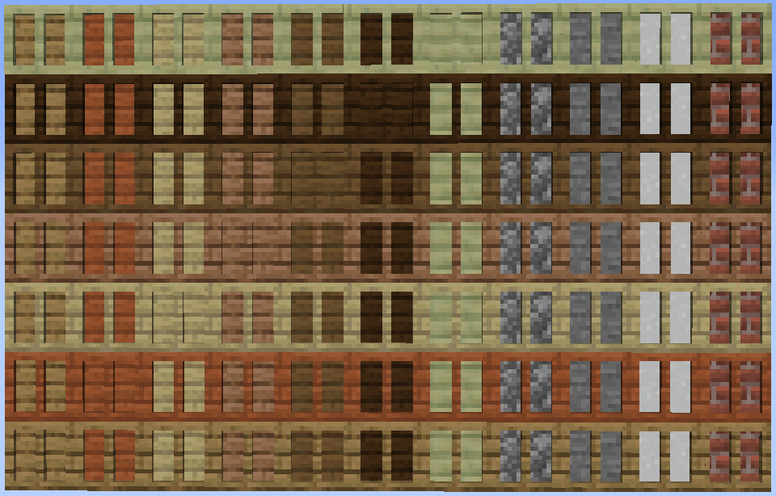
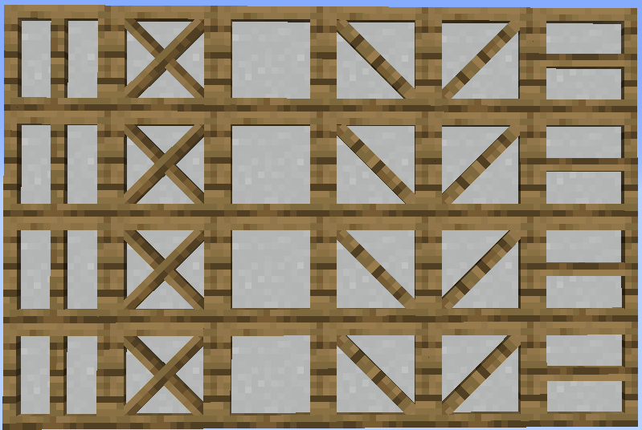

# Timber Frames

<strong>Recipe:</strong> 
    <recipe>timberframeplain</recipe>
    
<strong>Recipe:</strong> 
    <recipe>timberframealtoak</recipe>
    
<strong>Recipe:</strong> 
    <recipe>timberframealtacacia</recipe>
    
<strong>Recipe:</strong> 
    <recipe>timberframealtbirch</recipe>
    
<strong>Recipe:</strong> 
    <recipe>timberframealtjungle</recipe>
    
<strong>Recipe:</strong> 
    <recipe>timberframealtspruce</recipe>
    
<strong>Recipe:</strong> 
    <recipe>timberframealtdarkoak</recipe>
    
<strong>Recipe:</strong> 
    <recipe>timberframealtcactus</recipe>

 

## The Item
 
The Timber Framed Blocks are new blocks added with Structurize. The Timber Framed Blocks come in various wood frames, as seen in the first recipe, surrounding not only wood centers but also cactus, cobblestone, stone, paper and bricks. (The outside frames are only in wood and cactus.) 

 

For the rest of the variants you just have to put a version of the Timberframe into the crafting table until you get the version you want. The crafting starts with the plain version and at the end becomes the plain version again, so if you have the wrong kind of Timber Framed Block you can easily start over again until you get the one you want. (Shown above in the recipes below the first with every kind of wooden frame.)

 

### Note: We use paper as a solid block in the example, you can do the same with every other above mentioned block.

 

## Using the Timberframes

To use the Timber Framed Blocks simply put them where you want them, however, they are directional, meaning they change orientation depending on how you place them. 
