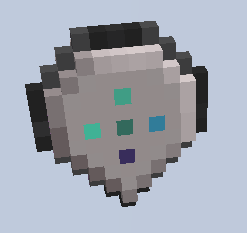

# Waypoint

    <recipe>waypoint</recipe>

  

Welcome to the Waypoint page.  

  

### The Block  

The waypoint block can be found in the Minecolonies tab in creative. It is used by builders to set waypoints within schematics. In the schematics they are solid blocks. Waypoints can be crafted in survival in order to create a new build. Placing the build tool in the center and surrounding it by any type of planks. This will give you 16 waypoint placeholders.

However, you can place the invisable, but usable waypoints for citizens to use by using the build tool. The waypoint is listed under infrastructure.

Waypoints are only seen when actively using the build tool, either to place a building, decoration or other item.

To remove waypoints, simply place any block in the place they are, for 30 - 60 seconds. When you remove those blocks, the waypoint will be removed.

