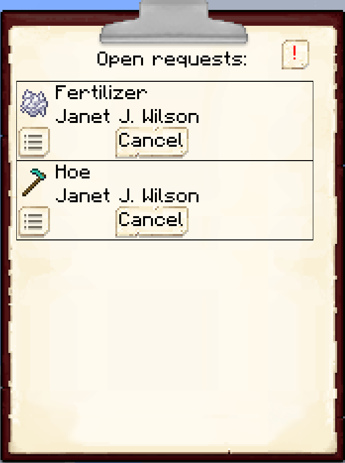
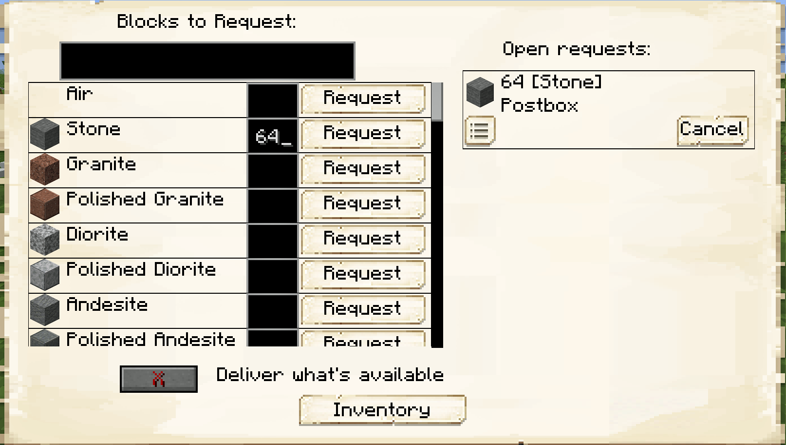

# Request System

As the mayor of a fledgling colony, you are sure to be busy managing your citizens and the multitude of issues that arise. At some point, you’ll have too many citizens to deal with every single one of their demands individually.

Thankfully, there’s the Request System! Citizens will automatically ask for the items they need to perform their jobs, and if those items can be provided by your other citizens, they will do so! 

## Getting Started

The request system is based on two components: the [Warehouse](../../source/buildings/warehouse) — which stores all of your colony’s resources — and the [Couriers](../../source/workers/courier) — who pick up and drop off items between buildings. The Couriers wait in the Warehouse until a request comes in.

When a citizen realizes that they need an item, they’ll first look in their inventory, hut block, and [Racks](../../source/items/rack) in their hut. If they cannot find the item in these locations, they’ll then make a request automatically. If this item is in the Warehouse, a Courier will then take it from the Warehouse and deliver it to your citizen automatically.

## Crafting Requests

But what if you don’t have that item in your Warehouse? In that case, your citizens will check who is able to make that item and attempt to ask them to make it. For example, if your builder needs some oak stairs and there aren’t any in the Warehouse, your [Carpenter](../../source/workers/carpenter) will check if they know how to make oak stairs. If they do, then they’ll request some oak planks to turn into stairs. If there aren’t any oak planks but the carpenter also knows how to make them from oak logs, then they’ll request oak logs to turn into oak planks to turn into oak stairs. Your citizens will keep making and trying to fulfill requests until they have the items they need or they cannot fulfill a request given their jobs and knowledge. As such, it’s convenient to get as many citizens working different jobs as you can to fulfill as many of their requests as they can automatically!

## Manual Requests
<!-- Put a picture of the red gear for manual requests here!-->
What if your builder asks for oak stairs but you don’t have a carpenter yet? In that case, the request can’t be filled automatically, and the citizen will wait for you, the mayor, to fulfill the request manually. These citizens will have a red gear over their head and, in talking to them, will tell you what they need. Once you have that item they need, you can give it to them directly or put it in the Warehouse for your Couriers to deliver.

## Clipboard

Of course, being the busy mayor you are, you’ll want to be able to see all of your citizens’ requests without running to each one. For this, there’s the [Clipboard](../../source/items/clipboard). Simply right-click the air with your clipboard and you can see all of your citizens’ requests, no matter where you are (as long as you're close to your colony)!

 

 

Some of your citizens will always have constant requests (e.g., the [Smelter](../../source/workers/smelter) requesting ores). Clicking the "Show Important Requests Only" hides these constant requests, so you can focus on the requests that bottleneck your citizens' work.

## Stash/Postbox

As your colony grows, so too will the number of items and blocks in your Warehouse and that your citizens can produce. Searching the Warehouse each time you want something can be tedious. Thankfully, your colony has a [Postbox](../../source/items/postbox), from which you can make requests just like your citizens! Simply place it down somewhere you can easily access and, when you want to request an item from your colony but don’t want to hunt it down, make a request at the postbox. These can range from held items to placeable blocks to any items your workers can craft.

    

    <recipe>postbox</recipe>

If you right-click the postbox, you'll see the GUI.

For convenience, your colony also has a [Stash](../../source/items/stash). The stash behaves like a reverse postbox: Couriers will take any items you place in the stash and put them back in the Warehouse.

    

    <recipe>stash</recipe>

## Priority

Finally, you can adjust the order in which Couriers pick up items from each building by changing that building's *priority*. Higher numbers mean higher priority, so buildings with a priority of 10/10 are visited before buildings with a priority of 1/10. This can help ensure the colonists doing urgent jobs are not delayed by those with less urgent jobs.

Priority only affects pickup, though; deliveries *from* the Warehouse *to* other buildings or the postbox are always high priority.
