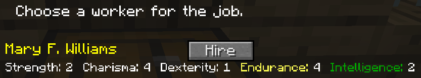
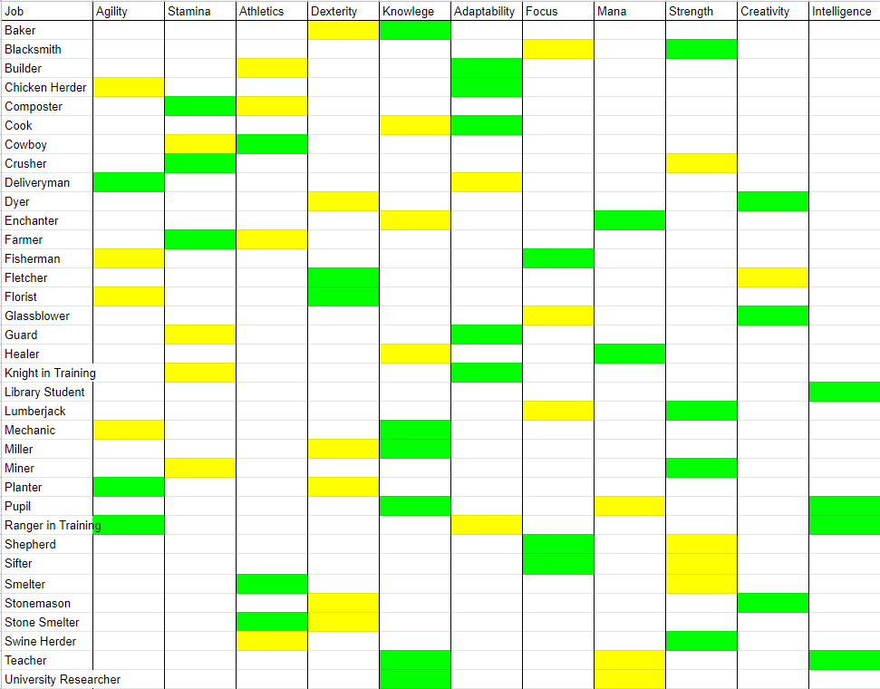

# Worker System

<b> If it is raining, snowing, nighttime, or a citizen died yesterday (in-game time), your citizens will stop working!</b>

## Traits
When hiring a worker at a hut, the primary trait used in that work will be highlighted in **green** and the secondary trait in **yellow** to help you decide which citizen is the best worker for the job. The higher a worker's level, the faster and more efficient they will be.

These skills make up the worker's level. The formula is (Primary Trait + Secondary Trait)/4 = Level (rounded down).

For example, if Adaptability is the primary trait and Athletics secondary, and the worker assigned has Adaptability 29 and Athletics 16, then (29+16)/4=11.25.That means that this worker's level will be 11!

Workers' skills/levels increase as they work. Their level is limited by the level of the worker's home. The level of a worker's work hut and their Intelligence skill level affect the speed that they level up.

| Home Level | Max Worker Level |
| ---------- | ---------------- |
| 0          | 1                |
| 1          | 5                |
| 2          | 10               |
| 3          | 15               |
| 4          | 20               |
| 5          | 100              |

 

A chart of all the jobs and their traits, from sikri(#2346) on [Discord](https://discord.minecolonies.com):
 
 

## Tool/Sword Levels

The type of tools/swords workers can use depends on the level of a worker's work hut.

| Work Hut Level | Max (Vanilla) Tool/Sword Level                                                                                           | Max (Tinker's Construct) Tool/Sword Level |
| -------------- | ------------------------------------------------------------------------------------------------------------------------ | ----------------------------------------- |
| 0              | Wood or Gold (+ 0 enchantments)                                                                                          | Mining level of Stone                     |
| 1              | Stone + 0 enchantments (OR wood/gold + 1 enchantment)                                                                    | Mining level of Iron                      |
| 2              | Iron + 0 enchantments (OR wood/gold + 2 enchantment OR stone + 1 enchantment)                                            | Mining level of Diamond                   |
| 3              | Diamond + 0 enchantments (OR wood/gold + 3 enchantments OR stone + 2 enchantments OR Iron + 1 enchantment)               | Mining level of Obsidian                  |
| 4              | All Tools + 0 enchantments (OR wood/gold + 4 enchants OR Stone + 3 enchants OR Iron + 2 enchants OR diamond + 1 enchant) | Mining level of Cobalt                    |
| 5              | All Tools + unlimited enchantments                                                                                       | Any mining level                          |

## Bow/Fishing Rod Levels

There is also a system in place for the type of bows and fishing rods workers can use. This also depends on the level of a worker's work hut.

| Work Hut Level | Enchantments            |
| -------------- | ----------------------- |
| 0              | 0 enchantments          |
| 1              | 0 enchantments          |
| 2              | 1 enchantments          |
| 3              | 2 enchantments          |
| 4              | 3 enchantments          |
| 5              | Unlimited enchantments  |

## Guard Armor Levels

There is also a system in place for the type of armor [Guards](../../source/workers/guard) can use. This depends on the level of their Tower and the worker level of the Guard.

| Type of Armor | Guard Level | Tower Level |
| ------------- | ----------- | ----------- |
| Leather       | 0 - 20      | 1 - 3       |
| Gold          | 0 - 20      | 1 - 4       |
| Chain         | 0 - 20      | 2 - 5       |
| Iron          | 5 - 30      | 3 - 5       |
| Diamond       | 15 - 99     | 4 - 5       |
