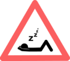

# Worker Traits and Leveling up System

<b>Rainy weather will make your citizens stop Working!!!</b>

## Workers' Skill Level

There is a system in place for how the workers skills "Level Up". The level of their HOME is what will put a limit on the "Worker Skill Level" they can achieve. Every time you level up their HOME, the worker's max level limit will be DOUBLE the previous limit! Currently the limit on the Workers' "Skill Level" is 100 (once you have made his building level 5, of course). The level of their WORK building determines the speed at which they level up.

| Building Level | Max Worker Level |
| -------------- | ---------------- |
| 0              | 2                |
| 1              | 4                |
| 2              | 8                |
| 3              | 16               |
| 4              | 32               |
| 5              | 100              |

## Tool/Sword Levels

There is also a system in place for the type of tools and swords the workers can use depending on the level of their WORK building. The level of their building is what will put a limit on the "Tool/Sword Level" the worker will be able to use. Every time you level up their building, the level of the tool/sword the worker can use will increase.

| Building Level | Max Tool/Sword Level Vanilla | Max Tool/Sword Level Tinkers   |
| -------------- | ---------------------- | ------------------------ |
| 0              | Wood  or Gold (+ 0 enchant)    | Mining level of Stone    |
| 1              | Stone + 0 enchant (OR wood/gold + 1 enchant)  | Mining level of Iron     |
| 2              | Iron + 0 enchant  (OR wood/gold + 2 enchanst OR stone + 1 enchant)  | Mining level of Diamond  |
| 3              | Diamond + 0 enchant (OR wood/gold + 3 enchants OR stone + 2 enchants OR Iron + 1 enchant)  | Mining level of Obsidian |
| 4              | All Tools + 0 enchant (OR wood/gold + 4 enchants OR Stone + 3 enchants OR Iron + 2 enchants OR diamond + 1 enchant)  | Mining level of Cobalt   |
| 5              | All Tools + unlimited enchants  | Any mining level   |

## Bow/Fishing Rod Levels

There is also a system in place for the type of bows and Fishing Rods the workers can use depending on the level of their building. The level of their building is what will put a limit on the enchantments that the "Bow/Fishing Rod" can have so the worker will be able to use. Every time you level up their building, the amount of enchantments that the Bow/Fishing Rod can have for the worker to use will increase.

| Building Level | Enchants  |
| -------------- | ------------- |
| 0              | + 0 enchant   |
| 1              | + 0 enchant   |
| 2              | + 1 enchant   |
| 3              | + 2 enchant   |
| 4              | + 3 enchant   |
| 5              | + unlimited   |

## Guard Armor use Table

There is also a system in place for the type of Armor the guards can use depending on the level of their Tower AND the skill level of the guard. Every time you level up their building AND the guard levels up, the level of the Armor the guard can use will increase.

| Type Armor | Guard Level | Tower Level |
| ---------- | ----------- | ----------- |
| Leather    | 0 - 20      | 1 - 3       |
| Gold       | 0 - 20      | 1 - 4       |
| Chain      | 0 - 20      | 2 - 5       |
| Iron       | 5 - 30      | 3 - 5       |
| Diamond    | 15 - 99     | 4 - 5       |

## Traits

Next to the Worker are the best "Traits" for each worker to have in order for him/her to "level Up" at a faster rate.

When you click on the "Hire" button, you will see a list of the available workers and the best "Traits" for the specific worker you are hiring will be in green (primary) and yellow (secondary) to help you decide which is the best worker for hire.

There is a Formula for this: Primary Trait * 2 + Secondary Trait * 1 = Rate of Level Up.

For example; if Intelligence is Primary (green colored) and Endurance Secondary (yellow colored) and the worker assigned has Intelligence "2" and Endurance "4" that is (2x2)+(4x1) = 8

That means that this worker will be able to *level up* **8 times faster**.

## Workers

Choose a worker to view more information about them:

| Job Description                          | Primary Traits           |
| ---------------------------------------- | ------------------------ |
| [Baker](../workers/baker)                | Knowledge & Dexterity    |
| [Blacksmith](../workers/blacksmith)      | Strength & Focus         |
| [Builder](../workers/builder)            | Adaptability & Athletics |
| [Chicken Herder](../workers/chickenherder) | Adaptability & Agility |
| [Composter](../workers/composter)        | Stamina & Athletics      |
| [Cook](../workers/cook)                  | Adaptability & Knowledge |
| [Cowboy](../workers/cowboy)              | Athletics & Stamina      |
| [Crusher](../worker/crusher)             | Stamina & Strength       |
| [Deliveryman](../workers/deliveryman)    | Agility & Adaptability   |
| [Dyer](../workers/dyer)                  | Creativity & Dexterity   |
| [Enchanter](../workers/enchanter)        | Mana & Knowledge         |
| [Farmer](../workers/farmer)              | Stamina & Athletics      |
| [Fisherman](../workers/fisherman)        | Focus & Agility          |
| [Fletcher](../workers/fletcher)          | Dexterity & Creativity   |
| [Florist](../workers/florist)            | Dexterity & Agility      |
| [Glassblower](../workers/glassblower)    | Creativity & Focus       |
| [Guard](../workers/guard)                | Adaptability & Stamina   |
| [Healer](../workers/healer)              | Mana & Knowledge         |
| [Knight in Training](../workers/knightintraining) | Adaptability & Stamina   |
| [Library Student](../worker/librarystudent) | Intelligence          |
| [Lumberjack](../workers/lumberjack)      | Strength & Focus         |
| [Mechanic](../workers/mechanic)          | Knowledge & Agility      |
| [Miner](../workers/miner)                | Strength & Stamina       |
| [Miller](../workers/miller)              | Knowledge & Dexterity    |
| [Planter](../workers/planter)            | Agility & Dexterity      |
| [Pupil](../workers/pupil)                | Intelligence & Knowledge, Mana |
| [Ranger in Training](../workers/rangerintraining) | Agility & Adaptability   |
| [Researcher](../workers/researcher)      | Knowledge & Mana         |
| [Shepherd](../workers/shepherd)          | Focus & Strength         |
| [Sifter](../workers/sifter)              | Focus & Strength         |
| [Smelter](../workers/smelter)            | Athletics & Strength     |
| [Stonemason](../workers/stonemason)      | Creativity & Dexterity   |
| [Stone Smelter](../workers/stonesmelter) | Athletics & Dexterity    |
| [Swine Herder](../workers/swineherder)   | Strength & Athletics     |
| [Teacher](../workers/teacher)            | Intelligence & Knowledge, Mana |
