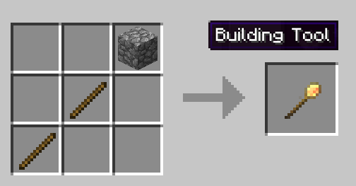

# Building Tool

 
Welcome to the Building Tool page. Crafting the building tool is simple and it is *THE* most important tool you will need for the entire mod. With the building tool you can place the Supply Ship or Supply Camp, all the buildings, worker huts and even even any structure scanned by you ([Schematics](../tutorial/schematics) in the perfect spot. The possibilitites are endless! Watch a short video of how it works here:
  

<b><a name="build_tool">Build Tool Video.</a></b>

<embed width="854" height="480" src="https://www.youtube.com/embed/DVGGDUXbTOY" frameborder="10" allow="autoplay; encrypted-media" allowfullscreen>

 

### Step One
 
The first step is to craft the Building Tool like so:

 

### Step Two

To place a Worker hut or a Bulding (from the mod) you have to have the Hut block you have crafted in your Inventory. Then you can right click on the block where you want to place it. The GUI will pop up where you have many options:

 

 

**Left Drop Down:** Here you will see 3 general categories; My Schematics, Decorations and Hut Blocks/Building Blocks.

- My Schematics- In this category you will see all the scans you have made.
- Decorations- In here are already several structures considered decoration that you can use. Or if you have placed your own scans in this folder (to organized them as decorations).
- Hut Blocks/Building Blocks- When you have a Hut/Building block in your inventory (or several) it will apear in the list for you to place and view.

**Middle Drop Down** This is where you will see the different styles (according to what you have chosen in left drop down).

**Right Drop Down** Here you will be able to see, depending on what you chose:

- From My Schematics- the name of the schematic (either auto-generated or if you have named it).
- From Decorations- all decoration that are of the specified "style" previously chosen in middle drop down.
- From Hut Blocks/Building Blocks- The level of the building (previously chosen in middle drop down) from level 1 to level 5.

 

**Right in the middle of the screen** are the controls to "adjust" the structure you are about to place.

- The blue *arrows* are so you can move the 3D structure you are viewing (front - back - right - left).
- The orange *Minus* and *Plus* signs are to *Raise* or *Lower* the structure. 
- The orange *Curved Arrows* are to *Rotate* teh structure left or right.
- The orange *triangles* in the middle are to *mirror* the image (to change right to left and left to right).
- The green *Check Mark* is when you are done and want to "commit" to *placing it*.
- The red *X* is to *cancel* te whole process.

- **Note:** When in creative you will also see in the lower right the *Copy* and *Paste* options.

 

### Step Three

