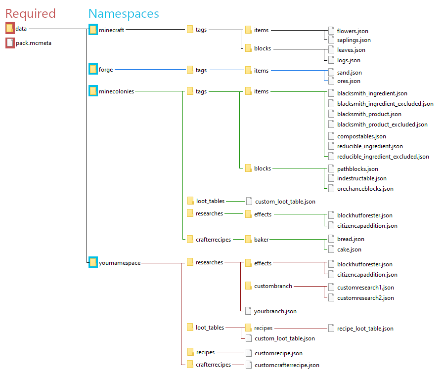

# Data Pack

- [Concepts](#concepts)
  - [Terminology](#terminology)
  - [Example Folder Layout](#example-folder-layout)
- [Tags](#tags)
  - [Block Tags](#block-tags)
  - [Item Tags](#item-tags)
  - [Crafter Item Tags](#crafter-item-tags)
- [Crafter Recipes](#crafter-recipes)
- [Player Recipes](#player-recipes)
- [Loot Tables](#loot-tables)
- [Research Customization](#research-customization)
  - [Branches](#branches)
  - [Research](#research)
  - [Research Effects](#research-effects)
  - [MineColonies Research Effects](#minecolonies-research-effects)
  - [MineColonies Building Unlocks](#minecolonies-building-unlocks)

MineColonies allows modifications of many features using data packs, including player and worker recipes, loot tables, and mob drops. This allows broad expansion by players or modpack makers to support other mods, design choices, forms of progression, or styles of play. For general information on Minecraft data packs, [see the official wiki](<https://Minecraft.fandom.com/wiki/Data_Pack>).

Data packs exist as part of a world, and they must be [installed](https://Minecraft.fandom.com/wiki/Tutorials/Installing_a_data_pack) on each world.

## Concepts

Data packs are one or more files in the JSON format, stored within a folder or a zip file. Despite their names, these are text files, and can be opened with text editors. Note that Windows will, by default, hide the extension of known files, and this [should be changed](https://support.microsoft.com/en-us/windows/common-file-name-extensions-in-windows-da4a4430-8e76-89c5-59f7-1cdbbc75cb01) to avoid accidentally appending .txt to the file name. Avoid using a rich text editor like WordPad or Microsoft Word, which may insert additional formatting into the file. On Windows, simple text editors like Notepad, NotePad++, or WattPad are more useful for making small numbers of these files, and development environments like IntelliJ may be worth installing if creating many JSONs.

The JSON format is both generous and fastidious. It does not particularly care if you add extra fields, but it will choke on a missing comma or brace. Minecraft will report the file and location of a JSON error in the error log, but it may also be useful to check files in a JSON validator tool, colloqually known as a [linter](https://jsonlint.com/), as you create them. The JSON format will accept most characters, though the double-quotes (<code>"</code>) and backslash (<code>\</code>) characters must first be 'escaped' by prefixing them with a backslash (such that <code>"</code> becomes <code>\"</code> and <code>\\</code> becomes <code>\\</code>).

For most users, looking at other similar JSONs will be the fastest way to get started. For those interested in the specific rules of the format, [see here](https://www.json.org/json-en.html).

The data pack folder or zip file can be any valid file name, and will be used to determine the name of the data pack. This folder or zip file must contain in its root level a file named **pack.mcmeta**, [with a specific format](<https://Minecraft.gamepedia.com/Data_Pack#pack.mcmeta>). It is strongly encouraged to provide a distinct name and description for your data pack: this will show up as a tooltip from the in-game interfaces and /datapack list command. To act as a data pack, this should also contain a "data" directory.

Each folder within that "data" directory acts as a different **namespace**. Most mods have their own specific namespaces: for MineColonies, this is "minecolonies". As a rule, all folders and files within a datapack, including the namespace folders, **must** have names consisting solely of lowercase alphanumeric characters, underscores (_), dashes (-), and dots (.). Any other characters, including uppercase letters, will cause Minecraft to fail to load the data pack, and give a largely unhelpful error. Completely empty names are considered legal and read, but not all mods will support them.

<b>Data packs are very picky. A single misplaced comma, missing quotation mark, or invalid file name will give an error. If a file doesn't seem to be applying, or a datapack is giving errors on world load, check your file's formatting first.</b>

Files that exactly match the namespace, directory, and name of a file from vanilla Minecraft, a mod, or another data pack will either completely override or merge with that other JSON, depending on the file's type. A data pack can have multiple namespace directories, and the most common approach is to use a mod's namespace when directly overriding an existing JSON from vanilla or a mod, and a unique namespace when adding or modifying content or modifying another data pack. It's encouraged to add to the <code>forge</code> and <code>Minecraft</code> namespaces only when adding to or modifying vanilla or forge defaults, to use the <code>minecolonies</code> namespace when modifying existing MineColonies files, and to use your own namespace when adding new types, or completely removing a crafter recipe or research.

### Terminology

| Resource Location   | The common word for Mojang's [Namespaced IDs](https://Minecraft.fandom.com/wiki/Namespaced_ID#Namespace). A string of format <code>namespace:path</code>, with strict limitations on allowed characters, all lower-case, and only one colon (:). Used heavily in newer versions of Minecraft to uniquely identify nearly everything. |
| Namespace | The first half of a Resource Location, before the colon (:). In <code>Minecraft:cobblestone</code>, "Minecraft" is the namespace. Commonly used namespaces are "Minecraft", "forge", and "minecolonies". Modpack makers may want to select their own namespace, to avoid potential conflicts. In data packs, namespaces are derived from the names of the folders at the top level within the "data" directory. |
| Data Location | The internal location within namespaces that Minecraft and mods examine for specific uses, such as <code>tags/blocks</code> for Block Tags, or <code>crafterrecipes</code> for Crafter Recipes. Only JSONs within a known data location are applied by Minecraft or Minecraft mods, and Data Locations control how these JSONs apply and what format is expected. Relevant Data Locations are described in more detail throughout this document. |
| Path      | The second half of a Resource Location, after the colon (:). In <code>Minecraft:cobblestone</code>, "cobblestone" is the path. In data packs, Paths are derived from the folders and filenames within a specific Data Location. <code>data/Minecraft/tags/items/cobblestone.json</code> will have a namespace of "Minecraft", a Data Location of "tag/items", a path of "cobblestone". |
| Type      | The supported format for a specific context. Includes Objects, Arrays, Strings, Booleans, Integers, and Doubles. |
| Object    | In the context of the JSON standard, a group of key-value pairs held together by a pair of curly brackets (<code>{ }</code>). All JSON files must be a JSON Object, and name-value pairs may use an Object as a value. |
| Array     | In the context of the JSON standard, a group of value types held together by a pair of square brackets(<code>[ ]</code>). JSON Arrays may contain multiple Values, or multiple Objects, but not name-value pairs directly. |
| String    | A set of characters. In JSON, strings must always be within quotation marks (<code>" "<code>). |
| Boolean   | The values <code>true</code> or <code>false</code>, not contained within quotation marks. |
| Integer   | A whole number. For this document, between positive and negative two billion, not contained within quotation marks. You generally won't use numbers that high. |
| Double    | A number, including decimal numbers, not contained within quotation marks. |
| Name-Value Pair | In the context of the JSON standard, a string key and an matching value, usually in the format <code>"name": value</code>. Name-value pairs that are not the last name-value pair in an Object must be separated by a comma (<code>,</code>). |
| Name      | In the context of the JSON standard, the left half of a name-value pair. Must be a String. Only one occurance of a name will be read in a single object's top level, usually the first, though sibling in an array or descendants in objects may hold the same Name. |
| Value     | In the context of the JSON standard, the right half of a name-value pair. May be any type that matches the context. Values within quotation marks (<code>" "</code>) are treated as Strings. |
| Translation Key | A specially formatted string, which will attempt to be processed through the Minecraft translation file. If the client language file contains a matching Name, substitutes the corresponding Value, otherwise, presents the key to the user directly. |

### Example Folder Layout

A complex data pack can have many files across many types in many namespaces, as shown below. Smaller data packs consisting of tweaks or settings changes may only have two or three files.

<b>The pack.mcmeta file is mandatory, and Minecraft will not load a data pack without one, or with an improperly formatted one.</b>

For Minecraft 1.16, a typical pack.mcmeta file looks like this: 

<pre><code>{
  "pack": {
    "pack_format": 6,
    "description": "Rename To Your Preferences"
  }
}
</code></pre>

The <code>"description"</code>'s value is displayed to the user, so it's best to make it descriptive and unique.

## Tags
  
 **Tags** are a vanilla Minecraft feature, used to give properties to specific items (if within the <code>tags\items</code> directory) or blocks (if within <code>tags\blocks</code> directory). Item tags also used for Ore Dictionary behaviors. Tags apply a property based on the file name: <code>\data\minecolonies\tags\blocks\concrete.json</code> applies a <code>#minecolonies:concrete</code> tag to all blocks matching the Resource Locations contained within it or within Block Tags matching that Resource Location, and that <code>#minecolonies:concrete</code> block tag determines what materials a [Concrete Mixer](../../workers/concretemixer) can mine.
 
 All Tag JSONs operate in **merge** mod by default. They can instead override, removing any other blocks or items from JSONs matching that name that were loaded first. To use override mode, you must explicitly set <code>"replace" : true</code> in addition to the <code>"values" : </code> name-value pair. This <code>"replace"</code> name is not mandatory for merge mode, but for ease of readability, it's strongly encouraged to use <code>"replace" : false </code> if intentionally adding to existing Tags.
 
 The only other supported name-value pair for a Tag JSON is the <code>"value":</code> Name. This accepts an Array of identifiers or tags as individual Resource Location strings. These string must contain the namespace and an item identifier in resource location format, matching either a single object of that tag's type, or another Tag prefixed by the # symbol. Missing or mistyped targets may cause the file to be ignored, or for Minecraft to throw an error on world load. Use the Advanced Tooltip functionality (F3 + H) in Minecraft to turn on display of Resource Locations in item tooltips for help finding specific strings.
 
 A typical tag file to add cobblestone and every type of vanilla anvil to a Tag would thus look like : 
 
 <pre><code>{
    "replace": false,
    "values": [
      "Minecraft:cobblestone",
      "#Minecraft:anvil"
    ]
}</code></pre>

<b>While this example works for both Blocks and Items, it's a rare exception. Block Tags and Item Tags are entirely different things, and while some Block Tags have Item Tag equivalents, many do not. Some mods will *only* use Item Tags or Block Tags; some items, even vanilla items, have different Resource Locations when in Item form than in Block form.</b>

 
 
 <TODO: The required:false properties act very unpredictably with tags. Need to get a better grasp on this before I can publish it.>
 In 1.16, Forge also supports Optional tags. If a data pack lists a block or item that isn't available, such as if it's from a mod that is not loaded, or if the block or item has been disabled. Optional tags are separate JSON objects, containing an id:string and a "required":false value.

 <pre><code>{"id": "waystones:sandy_waystone", "required": false}</code></pre>
 
 
### Block Tags

 **Block Tags** are loaded in the <code>tags/blocks</code> directory. MineColonies reads the following Block Tags:
 
| Namespace               | Block Tag              | Effect                   |
| ----------------------- | ---------------------- | ------------------------ |
| <code>minecolonies</code>    | <code>concrete</code>               | Blocks that a [Concrete Mixer](../../workers/concretemixer) can mine. |
| <code>minecolonies</code>    | <code>decoblocks</code>             | Blocks that are not replaced by builders during construction phases. |
| <code>minecolonies</code>    | <code>indestructable</code>         | Blocks that can't be destroyed. Prevents these blocks from being overwritten by Survival Build Tools, and has special considerations for colonist pathfinding. |
| <code>minecolonies</code>    | <code>orechanceblocks</code>        | Blocks that which will have a low chance of dropping extra ores when mined by a [Miner](../../workers/miner). |
| <code>minecolonies</code>    | <code>pathblocks</code>             | Colonists walk faster on and preferentially follow roads made of these blocks. |
| <code>minecolonies</code>    | <code>protectionexception</code>    | Blocks that can be used, or alt-clicked, within a [colony's protection range](../../systems/protection), even by neutral or enemy players. |
| <code>forge</code>           | <code>dirt</code>                   | Blocks that can be used as farmland by farmers. |
| <code>Minecraft</code>       | <code>beds</code>                   | Blocks that can be used by colonists to rest, if included in a schematic. |
| <code>Minecraft</code>       | <code>doors</code>                  | Used for pathfinding. |
| <code>Minecraft</code>       | <code>leaves</code>                 | Used to determine eligible trees for the Forester. |
| <code>Minecraft</code>       | <code>logs</code>                   | Used to determine eligible trees for the Forester. |
| <code>Minecraft</code>       | <code>shroomlight</code>            | Used to determine eligible trees for the Forester. |
| <code>Minecraft</code>       | <code>wart_blocks</code>            | Used to determine eligible trees for the Forester. |
 
### Item Tags

 Item Tags are loaded in the <code>tags\items</code> directory. MineColonies reads the following Item Tags:
 
| Namespace       | tags\\items               | Effect                   |
| --------------- | ------------------------- | ------------------------ | 
| <code>minecolonies</code>    | <code>compostables</code>              | Items that can be placed into a Composter, and give moderate compost. |
| <code>minecolonies</code>    | <code>compostables_poor</code>         | Items that can be placed into a Composter, and give little compost. |
| <code>minecolonies</code>    | <code>compostables</code>              | Items that can be placed into a Composter, and give a lot of compost. |
| <code>minecolonies</code>    | <code>concrete_powder</code>           | Crafted and placed by a [Concrete Mixer](../../workers/concretemixer) |
| <code>minecolonies</code>    | <code>florist_flowers</code>           | Grown by the [Florist](../../workers/florist), if they have a valid block form, at building level 3 or higher. |
| <code>minecolonies</code>    | <code>fungi</code>                     | Items that can be grown by a [Lumberjack](../../workers/lumberjack) on Warped Nylium or Crimson Nylium. |
| <code>minecolonies</code>    | <code>meshes</code>                    | Items that can be held as meshes by a [Sifter](../../workers/sifter). This only allows the Sifter to use the tool, it does not add benefits to doing so. See CrafterRecipes for more details. |
| <code>minecolonies</code>    | <code>reducible_ingredient</code>      | Items that may be reduced in cost by one, to a minimum of one, when in a colonist recipe that originally required more than one of the item. |
| <code>minecolonies</code>    | <code>reducible_product_excluded</code> | Output items that can never have their crafter recipe efficiency improved. Most storage blocks or reversable recipes should be in this tag, to avoid possible infinite item loops. |
| <code>forge</code>           | <code>crops_wheat</code>               | The Baker can cook any recipe including an in this tag, if the output is a food item. |
| <code>forge</code>           | <code>glass</code>                     | All items with this tag, if produces in a furnace from an item tagged with #forge:glass, can be made at the Glassblower. |
| <code>forge</code>           | <code>ores</code>                      | All items with this tag are treated as ores by the miner, and if processable in a furnace, can be processed in the smeltery. |
| <code>forge</code>          | <code>sand</code>                      | All items with this tag, if smeltable into an item tagged with #forge:glass, can be made at the Glassblower. |
| <code>forge</code>           | <code>seeds</code>                     | Only items with this tag are valid to set in a Scarecrow, and are planted by a farmer. |
| <code>Minecraft</code>       | <code>flowers</code>                   | Used by the Beekeeper to breed bees. |
| <code>Minecraft</code>       | <code>fishes</code>                    | Used by the Fisherman to render fish on bandolier. |
| <code>Minecraft</code>       | <code>leaves</code>                    | Items that Builders will place 'for free', without having in their inventory. |
| <code>Minecraft</code>       | <code>logs</code>                      | Recipes consisting of 75% or more this tag and #Minecraft:planks can be taught to the Sawmill. |
| <code>Minecraft</code>       | <code>planks</code>                    | Recipes consisting of 75% or more this tag and #Minecraft:logs can be taught to the Sawmill. A stack is stored by the Miner. |
| <code>Minecraft</code>       | <code>saplings</code>                  | Used by the Forester to grow trees.
| <code>Minecraft</code>       | <code>slabs</code>                     | A stack is stored by the Miner. |
| <code>Minecraft</code>       | <code>small_flowers</code>             | Grown by a building level 1 or 2 [Florist](../../workers/florist), if they have a valid block form, and are in #minecolonies:florist_flowers. |
| <code>Minecraft</code>       | <code>wool</code>                      | Used to by the Dyer to produce white wool, if not already White Wool. |

<b>Some Vanilla and Forge Item Tags are very expansive, or are used by some mods in ways that might surprise you. See [list of tags](https://Minecraft.fandom.com/wiki/Tag#List_of_tags) for Minecraft behaviors.</b>

### Crafter Item Tags

 Additionally, some **Item Tags** are used to control what recipes can be taught to a worker by a player in-game. Each worker has a different set of tags. For a full list, see [here](https://github.com/ldtteam/minecolonies/tree/version/main/src/main/resources/data/minecolonies/tags/items).
 
| Item Tag                           | Effect                   |
| ---------------------------------- | ------------------------ | 
| <code>x_product_excluded</code>    | Items that can not be made by this worker. Overrides all other crafter Tags. |
| <code>x_product</code>             | Items that can be made by this worker. |
| <code>x_ingredient_excluded</code> | Items that can not be used by this worker, unless the recipe product is in <code>x_product</code>.|
| <code>x_ingredient</code>          | Items that can be used by this worker, unless the ingredient is in <code>x_ingredient_excluded</code>, or the recipe output is in <code>x_product.json</code>. |

A few colonists have other hard-coded rules that are not dependent on tags. The Blacksmith can make all tools, swords, armor, hoes, and shields. Cooks will always accept recipes for items that have valid foods as results.

## Crafter Recipes

While Item Tags determine the recipes that workers can be taught, colonists can also automatically learn special **Crafter Recipes**. These recipes can be different than those available to the player, or even reflect items that can't be made in any other way. Unlike Tags, Crafter Recipes can and must hold a large number of properties, some containing arrays or objects of properties themselves. Supported properties include : 

| Crafter Recipe Key Name       | Object Name | Type    | Description              |
| ----------------------------- | ---------------------- | ------- | ------- | 
| <code>"type"</code>                    |              | string  | <code>"recipe"</code> to add a recipe, and <code>"remove"</code> to disable one. |
| <code>"crafter"</code>                 |              | string  | The name of the worker who will learn the recipe. Mandatory. |
| <code>"inputs"</code>                  |              | Array Of Objects | The <code>"item"</code>s and <code>"count"</code>s of the required input items that will be consumed for the recipe. |
|                                        | <code>"item"</code>       | string  | The Resource Location identifier of an item consumed by the recipe. |
|                                        | <code>"count"</code>      | integer | The number of that item consumed by default. If not present, defaults to 1. |
| <code>"result"</code>                  |              | string  | The Resource Location identifier of the item the recipe produces. |
| <code>"count"</code>                   |              | integer | The count of <code>"result"</code> items that should be returned. If not present, defaults to 1. |
| <code>"loot-table"</code>              |              | string  | The Resource Location of a [loot table](https://Minecraft.fandom.com/wiki/Loot_table), used for outputs that require some randomization. |
| <code>"additional-output"</code>       |              | Object | The <code>"item"</code> and <code>"count"</code> of a single additional output item.|
|                                        | <code>"item"</code>       | string  | The Resource Location identifier of an item consumed by the recipe. |
|                                        | <code>"count"</code>      | integer | The number of that item consumed by default. If not present, defaults to 1. |
| <code>"alternative-output"</code>      |              | Array Of Objects | Contains the <code>"item"</code> and <code>"count"</code> of alternative output items. These consume the same inputs, share the same "loot-table", and return the same "additional-output" as the main recipe, but produce a different result on demand through the Request System. |
|                                        | <code>"item"</code>       | string  | The Resource Location identifier of an item consumed by the recipe. |
|                                        | <code>"count"</code>      | integer | The number of that item consumed by default. If not present, defaults to 1. |
| <code>"intermediate"</code>            |              | string  | The Resource Location identifier of an item to display while the recipe is being crafted. |
| <code>"research-id"</code>             |              | string  | The Resource Location identifier of a research that is automatically learned after the colony has a research completed, if all other requirements are met. |
| <code>"not-research-id"</code>         |              | string  | The Resource Location identifier of a research that automatically causes the recipe to be unlearned. Most commonly used to replace a default recipe. |
| <code>"min-building-level"</code>      |              | integer  | The minimum building level, inclusive, at which the recipe may be automatically learned, if all other requirements are complete. |
| <code>"max-building-level"</code>      |              | integer  | The building level where the recipe will be automatically unlearned, if the building meets or exceeds it. |
| <code>"must-have"</code>               |              | boolean | A special requirement. If a recipe matching the output exists, automatically replaces that recipe and adds all <code>"alternative-output"</code> recipes. |
| <code>"recipe-id-to-remove"</code>     |              | string | A Resource Location of a different crafter recipe to remove, preventing buildings from learning it. Requires <code>"type":"remove"</code>. All other properties are ignored.|

Crafter Recipes already learned by a building will be immediately removed from that building if the recipe requirements are changed to values the building or colony does not meet. This is the preferred way to remove recipes in a data pack applied to a live world; the <code>"remove"</code> and <code>"recipe-id-to-remove"</code> settings will only prevent new buildings from learning the recipe.

For example crafter recipes, and their canonical names, see GitHub [here](https://github.com/ldtteam/minecolonies/tree/version/main/src/main/resources/data/minecolonies/crafterrecipes) and [here](https://github.com/ldtteam/minecolonies/tree/version/main/src/main/generated/resources/data/minecolonies/crafterrecipes).

## Player Recipes

**Player Recipes** can be added by data packs using vanilla features, by adding to the <code>recipes</code> Data Location. See the [Official Wiki](https://Minecraft.fandom.com/wiki/Recipe) for details, and the [GitHub for MineColonies default recipes](https://github.com/ldtteam/minecolonies/tree/version/main/src/main/resources/data/minecolonies/recipes).

## Loot Tables

**Loot Tables** control a variety of item drop behaviors, and can be used to add randomized chance to Crafter Recipes. They are loaded from <code>loot_tables</code>. See the [Official Wiki](https://Minecraft.fandom.com/wiki/Loot_table) for technical details, and the [GitHub](https://github.com/ldtteam/minecolonies/tree/version/main/src/main/generated/resources/data/minecolonies/loot_tables) for [some](https://github.com/ldtteam/minecolonies/tree/version/main/src/main/resources/data/minecolonies/loot_tables) MineColonies default loot tables.

## Research Customization

The Research System can be lightly tweaked or heavily modified through the use of data packs in MineColonies versions 0.14.0 or higher. For the default research data and example files, see [the GitHub](https://github.com/ldtteam/minecolonies/tree/version/main/src/main/generated/resources/data/minecolonies/researches). Researches consist of three components: the branch that contains the research, the research itself, and the research effect.

### Branches

Branches are the groups of research, such as "Civilian" or "Combat". Branch files must contain one of <code>"branch-name"</code> or <code>"base-time"</code>.

| Branch Key Name | Type       | Description |
| --------------- | ---------- | ----------- |
| <code>"branch-name"</code>   | string     | The displayed name of the branch, presented to the user. May be a Translation Key. If not present, defaults to a Translation Key of the format <code>com.<namespace>.research.<path>.name</code> |
| <code>"subtitle"</code>      | string     | A subtitle for the branch, displayed on mouseover. May be a Translation Key. Optional. |
| <code>"branch-type"</code>   | string     | An override for more specialized research branches. For now, <code>"unlockables"</code> disables research level checks. Otherwise, sets to default behavior. Optional. |
| <code>"base-time"</code>     | double     | A numeric multiplier applied to research time for all researches on the branch. Larger numbers take more time; lower numbers take less time. Very low values may make time estimates in-accurate. Defaults to 1.0; numbers below 0.0 or above 10 may behave poorly. |
| <code>"sortOrder"</code>     | integer    | Controls the vertical position of the branch on the University GUI. Lower numbers are placed first on the list, while higher numbers are placed closer to the bottom of the list. Optional. |
| <code>"hidden"</code>        | boolean    | If true, and if all primary researches on the branch are hidden, prevents access to the branch from the University window. If <code>"branch-type"</code> is set to <code>"unlockables"</code>, also prevents display of the branch; otherwise, provides a tooltip describing how unlock the branch's primary researches. Optional, defaults to false. |
| <code>"remove"</code>        | boolean or string or Array of Strings  | Removes a research branch, and all research on that branch, regardless of the source. May cause data loss if applied to an existing world. If a string, removes all research with a branch of the Resource Location in that string. If an array of strings, removes all researches for all researches with branches matching any of the Resource Locations. If boolean and true, removes all Researches with branches matching the Resource Location of the JSON itself; this form is discouraged for cases where other data packs may apply, as it may be conflicted by those other data packs. |

### Research

Researches are the individual components of a branch. Branches must have at least one present research to be displayed to the user.

| Research Key Name    | Object Key Name      | Type       | Description |
| -------------------- | ---------- | ---------- | ----------- |
| <code>"name"</code>            |       | string     | The displayed name of the research, presented to the user. May be a Translation Key. If not present, defaults to <code>com.<namespace>.research.<path>.name</code> |
| <code>"subtitle"</code>        |       | string     | A subtitle for the branch, displayed on mouseover. May be a Translation Key. Optional. |
| <code>"branch"</code>          |       | string     | A Resource Location of the branch for the Research. Used to check for Branch JSONs, and to connect to other research. |
| <code>"subtitle"</code>        |       | string     | A subtitle for the branch, displayed on mouseover. May be a Translation Key. Optional. |
| <code>"parentResearch"</code>  |       | string     | The Resource Location for a parent Research, which must be completed before this research may be unlocked. Required for Research of a level greater than 1. Must be on the same Branch as this research. |
| <code>"researchLevel"</code>   |       | integer    | The Research Level of the research. Unless set to <code>"branch-type":"unlockables"</code>, requires a University of equal or greater level to begin researches of levels 1 through 5, and only allows one level 6 research to be completed at a time. Defaults to 1 if not present. If above level 1, must have a valid parent one level lower. |
| <code>"sortOrder"</code>       |       | integer    | Controls the vertical position of the branch on the Research Tree GUI. Lowers numbers are placed higher up, while higer numbers are placed closer to the bottom. Optional, only applies to research with siblings. |
| <code>"exclusiveChildResearch"</code> |       | boolean     | If true and the research has more than one descendant research, allows completion of only one of those researches at a time. Optional, defaults to false. |
| <code>"no-reset"</code>        |       | boolean    | If true, prevents undoing the research. Defaults to false, has no effect if the research is already unresettable. |
| <code>"hidden"</code>          |       | boolean    | If true, does not display the research until its requirements are fulfilled. Defaults to false, has no effect if the research has no requirements or only has item costs. |
| <code>"autostart"</code>       |       | boolean    | If true, and the research has no item costs, begins the research automatically once its requirements are fulfilled. If the research has item costs, notifies logged-in players that it is available to begin. Defaults to false. |
| <code>"instant"</code>         |       | boolean    | If true, attempts to instantly (or within 30 seconds) complete the research after it has been begun. Defaults to false. |
| <code>"requirements"</code>    |       | Array Of Objects | Contains all of the requirements that must be fulfilled to unlock the recipe. |
|                                | <code>"item"</code> | string    | A Resource Location of an item consumed to begin the research. Multiple Item Objects are supported, though having more than 5 may display poorly on some monitors. Optionally pairs with "quantity". Items without NBT data match any NBT variant, but do require the item to be undamaged. |
|                                | <code>"quantity"</code> | integer | A number of items to be consumed. Pairs with "item", defaults to 1. |
|                                | <code>"building"</code> | string  | A specific building that must be present in the colony. Normal "building" requirements combine the levels from multiple of the same building type. Optionally pairs with "level", otherwise defaults to level 1. |
|                                | <code>"mandatory-building"</code> | string  | A specific building that must be present in the colony, with at least one occurence at least at the specifed level. Optionally pairs with "level", otherwise defaults to level 1. |
|                                | <code>"alternate-building"</code> | string  | A specific building to be added to the list of alternate-buildings. At least one of the alternate-buildings must be present in the colony to begin research. Optionally pairs with "level", otherwise defaults to level 1. Acts like "building" if only one <code>alternate-building</code> object is present. |
|                                | <code>"level"</code> | integer    | Specifies a building level. Pairs with <code>building</code>, <code>mandatory-building</code>, and <code>alternate-building</code>, otherwise has no effect. If not present for those requirements, defaults to 1. |
|                                | <code>"research"</code> | string  | A specific Research by Resource Location that must be completed to unlock this research. Unlike, <code>parentResearch</code>, can be on another branch, or of any research level. |
| <code>"effects"</code>         |       | Array Of Objects | Contains all of the effects of the research. Can be empty, either for research with no effects or for research that only unlocks crafterrecipes, or contain one or more Objects. |
|                   | <code>"string": integer</code>        | Name-Value Pair | The Research Effect Identifier as a Resource Location, followed by the level of the effect as an integer. If the level exceeds the maximum level of the effect, defaults to the maximum level. If no matching effect is found, applies a default strength of 6, enough to unlock a building completely. |
| <code>"remove"</code>        | boolean or string or Array of Strings  | Removes a research, regardless of the source. May cause data loss if applied to an existing world. If a string, removes any research matching the Resource Location in that string. If an array of strings, removes all researches matching any of the Resource Locations. If boolean and true, removes Research matching the Resource Location of the JSON itself; this form is discouraged for cases where other data packs may apply, as it may be conflicted by those other data packs. |

| <code>"icon"</code>            |       | string     | An icon displayed over completed research. Must be the Resource Location of an item, or a valid texture. Optional. |


### Research Effects

Research Effects describe the actual impact and strength of that impact on the colony, players, or colonists. All Research Effects have an automatically generated effect strength 0 at level 0. If no other levels are defined, defaults to level one having a strength of 5, enough to unlock all levels of a building.

| Effect Key Name | Type   | Description |
| --------------- | ------ | ----------- |
| <code>"effect"</code>        | any    | Required to treat the file as a research effect. |
| <code>"name"</code>          | string | The display name of the effect, shown on mouseover. May be a Translation Key. If not present, defaults to <code>com.<namespace>.research.<path>.description</code> |
| <code>"subtitle"</code>      | string | The subtitle of the effect, shown on mouseover. May be a Translation Key. Optional. |
| <code>"levels"</code>        | Array Of Doubles | The effect strengths of the research, by level. If not present, defaults to one level of strength 5. |

#### MineColonies Research Effects

For now, Research Effects must have a corresponding code effect, as listed below. Suggested ranges give guidelines assuming a modpack includes no significant balance reworks.

| Effect Resource Location | Suggested Range |   Description |
| ------------------------ | --------------- | --------------|
|"minecolonies:effects/archerdamageaddition"          |  -2 to 10    | Increases damage by Archer Guards. |
|"minecolonies:effects/citizeninvslotsaddition"       | 0, 9, 18, and 27 | Increases the number of inventory slots for colonists. |
|"minecolonies:effects/citizencapaddition"            | -21 to 475    | Increases the total number of colonists that may be active at a time above 25. Does not override serverconfig maximum. |
|"minecolonies:effects/enhancesgatedurabilityaddition"| -4 to 20      | Increases the durability of MineColonies Gates when attacked by raiders. |
|"minecolonies:effects/fleeingspeedaddition"          | 0 to 5        | Applies a Speed potion effect to injuried Guards when they flee for ten ticks, of Speed level equal to strength. |
|"minecolonies:effects/healingsaturationlimitaddition"| 0 to 20       | **Reduces** the required saturation before a colonist gets a bonus to regeneration rate. |
|"minecolonies:effects/healthaddition"                | -12 to 20     | Increases colonist max health. |
|"minecolonies:effects/meleedamageaddition"           | -3 to 10      | Increases Knight Guard damage. |
|"minecolonies:effects/workingdayhaddition"           | -2 to 2       | Increases the working day period for Worker Colonists. |
|"minecolonies:effects/archerarmormultiplier"         | -0.8 to 2     | Increases Archer Guard armor damage reduction. |
|"minecolonies:effects/armordurabilitymultiplier"     | 0 to 4        | Increases effective armor durability of all Guards (and other colonists that can wear armor). |
|"minecolonies:effects/blockattacksmultiplier"        | 0 to 1        | Increases Knight Guard rate of successfully blocking attacks. |
|"minecolonies:effects/blockbreakspeedmultiplier"     | -0.8 to 5     | Increases the Block Break speed of Miners and Builders. |
|"minecolonies:effects/blockplacespeedmultiplier"     | -0.8 to 5     | Increases the Block Place speed of Miners and Builders. |
|"minecolonies:effects/doublearrowsmultiplier"        | 0 to 1        | Applies a chance of Multishot effect on Archer Guards. |
|"minecolonies:effects/farmingmultiplier"             | 0 to 1        | Applies a chance to get additional crops from farming. |
|"minecolonies:effects/fleeingdamagemultiplier"       | -3.0 to 3.0   | Reduces damage suffered by low-health colonists when fleeing from attackers. |
|"minecolonies:effects/growthmultiplier"              | -0.8 to 5     | Increases rate children mature. |
|"minecolonies:effects/happinessmultiplier"           | -0.5 to 3.0   | Increases colonist Happiness. |
|"minecolonies:effects/levelingmultiplier"            | -1 to 3.0     | Increases the rate colonists gain experience. |
|"minecolonies:effects/meleearmormultiplier"          | -0.8 to 2     | Increases Knight Guard armor damage reduction. |
|"minecolonies:effects/minimumstockmultiplier"        | -0.8 to 5     | Increases the number of minimum stock a building can have simultaneously. |
|"minecolonies:effects/moreoresmultiplier"            | -0.8 to 5     | Increases chance of Miners finding additional ores when mining blocks with the <code>"#minecolonies:orechanceblocks"</code> Tag. |
|"minecolonies:effects/podzolchancemultiplier"        | -0.8 to 5     | Increases chance of a Composter producing Podzol when composting for dirt. |
|"minecolonies:effects/recipesmultiplier"             | -0.8 to 5     | Increases maximum number of recipes a building can contain. |
|"minecolonies:effects/regenerationmultiplier"        | -0.8 to 3     | Increases colonist regeneration rate, if not starving. |
|"minecolonies:effects/saturationmultiplier"          | -0.5 to 3     | Increases colonist Saturation from eating foods. |
|"minecolonies:effects/sleeplessmultiplier"           | -5 to 1       | **Reduces** the rate Guards fall asleep when increased. |
|"minecolonies:effects/teachingmultiplier"            | -0.8 to 5     | Increases student experience when learning from a Teacher as a child. |
|"minecolonies:effects/tooldurabilitymultiplier"      | -5 to 10      | Increases effective durability of colonist tools, including weapons. |
|"minecolonies:effects/walkingmultiplier"             |       | Increases colonist walk speed. |
|"minecolonies:effects/crushing11unlock"              |       | If above 0, allows the Crusher to produce one output item for one input. |
|"minecolonies:effects/consumearrowsunlock"           |       | If above 0, allows Archer Guards to use arrows to increase damage. If they run out of arrows, they'll still fire, just for less damage. Don't think about it. |
|"minecolonies:effects/knighttauntmobsunlock"         |       | If above 0, allows Knights to Taunt enemies, forcing most to target the Knight. |
|"minecolonies:effects/minerfireresunlock"            |       | If above 0, prevents any fire or lava damage to the Miner. |
|"minecolonies:effects/piercingarrowsunlock"          |       | If above 0, provides Piercing II to Archer Guards. |
|"minecolonies:effects/plant2unlock"                  |       | If above 0, allows the Plantation to have two output materials set at once. |
|"minecolonies:effects/platearmorunlock"              |       | If above 0, allows the Blacksmith to make plate armor. |
|"minecolonies:effects/railsunlock"                   |       | If above 0, allows Colonists to magically summon carts and ride railways. |
|"minecolonies:effects/retreatunlock"                 |       | If above 0, allows Guards to retreat if under 20% HP. |
|"minecolonies:effects/shieldusageunlock"             |       | If above 0, allows Knight Guards to use and request Shields. |
|"minecolonies:effects/whirlwindabilityunlock"        |       | If above 0, allows Knight Guards to use a Whirlwind Attack. |
|"minecolonies:effects/workinginrainunlock"           |       | If above 0, allows all workers and guards to work in rain. Has no effect if the server is set to do that anyway. |

### MineColonies Building Unlocks

Research Effects may also optionally unlock a building. These reserved Resource Locations will limit, and a research using the effect is loaded. The strength of the effect determines the maximum level of upgrade that can be requested for the building: an effect of strength 1 would allow only level 1 buildings, while strength 2 would allow upgrades to level 2, and so forth. They do not validate that these unlocks are reasonable, or even that they do not require the building that they unlock.

|blockhutarchery      |blockhutbaker        |blockhutbarracks     |blockhutbeekeeper    |blockhutblacksmith |
|blockhutbuilder      |blockhutchickenherder|blockhutcitizen      |blockhutcombatacademy|blockhutcomposter  |
|blockhutconcretemixer|blockhutcook         |blockhutcowboy       |blockhutcrusher      |blockhutdeliveryman|
|blockhutdyer         |blockhutenchanter    |blockhutfarmer       |blockhutfisherman    |blockhutfletcher   |
|blockhutflorist      |blockhutglassblower  |blockhutguardtower   |blockhuthospital     |blockhutlibrary    |
|blockhutlumberjack   |blockhutmechanic     |blockhutminer        |blockhutmysticalsite |blockhutplantation |
|blockhutrabbithutch  |blockhutsawmill      |blockhutschool       |blockhutshepherd     |blockhutsifter     |
|blockhutsmeltery     |blockhutstonemason   |blockhutstonesmeltery|blockhutswineherder  |blockhuttavern     |
|blockhuttownhall     |blockhutuniversity   |blockhutwarehouse    |                     |                   |