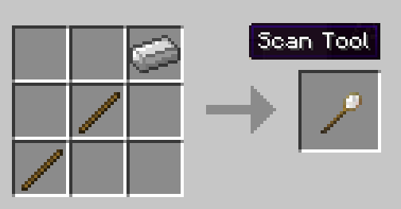

# Scan Tool

Welcome to the Scan Tool page. Crafting the scan tool is simple and it is a very very usefull tool. With the scan tool you can scan any structure you like and Have the builder build it for you. So find if you a building, house, walls, bridges, towers, shops or any structure that you want in your Town, you can build it in creative or paste it with world edit (f.e.) and then scan it. You can scan a structure in Singleplayer or Multiplayer (even on a server). The scanned structure will be in a schematic file that you can then use the build tool to place and have your Builder build it for you ([Schematics](../tutorial/schematics) Page for more info). Want your builder to clear an area for you (and level up while working.. of course) then scan an area of "air" and place it with the building tool over waht you want the builder to clear and watch him celar that area away leaving only "air" in it's place! The possibilitites are endless! Watch a short video of how it works here:

<b>Scan Tool Video</b>

<embed width="854" height="480" src="https://www.youtube.com/embed/mFIC3752o1c" frameborder="10" allow="autoplay; encrypted-media" allowfullscreen>

### Step One

The first step is to make a Scan Tool like so:

- **Hint:** There are two blocks in minecolonies mod that are made specifically for the helping players to make schematics.
* Placeholderblock. This block will not be scanned and will use the block it is substituting. F.e. air, grass, cobblestone, etc.
* Solid-Placeholderblock This block will guarantee the block placed will be solid according to the biome it's being build on. 

### Step Two

Then, all you have to do is left click the lower front corner (left or right makes no difference) at ground level of the structure.

### Step Three

Right click on the top opposite corner of the structure, you can use a "Placeholder" block for this. Leaving the entire structure inside this imaginary square.

### Step Four

At this point you will have two options: 

**1. you can shift + right click to directly "save the schematic".**

**2. or you can right click in the air again to get the scan tool GUI.**

Here you will be able to see the coords for the scan you just did. 
Also you will be able to give your scan a "name". 
Green arrow is if you are ready to save it or Red X to cancel the GUI and rescan again. 
You can click on the "Show Resources" Button to see all the blocks that are in the scan you just did. 
Finally you can scroll through all the blocks that are in the scan and you even have two options there:

* Remove.  To remove any of the blocks you se in your scan that you don't want in there. Some blocks can only be removed.
* Replace. To replace that block with any other block or type you prefer for that scan. AWESOME! Right?
