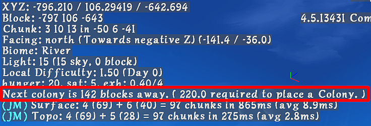
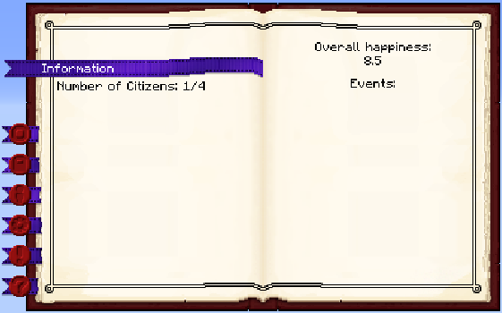
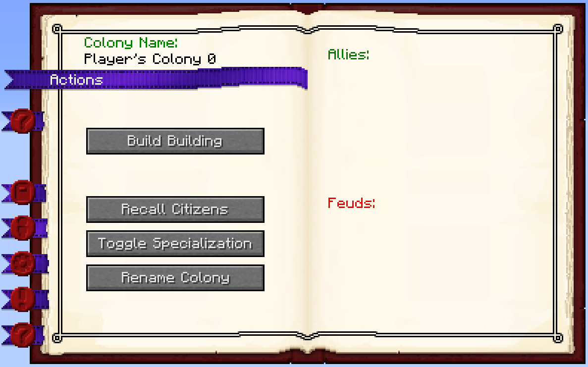
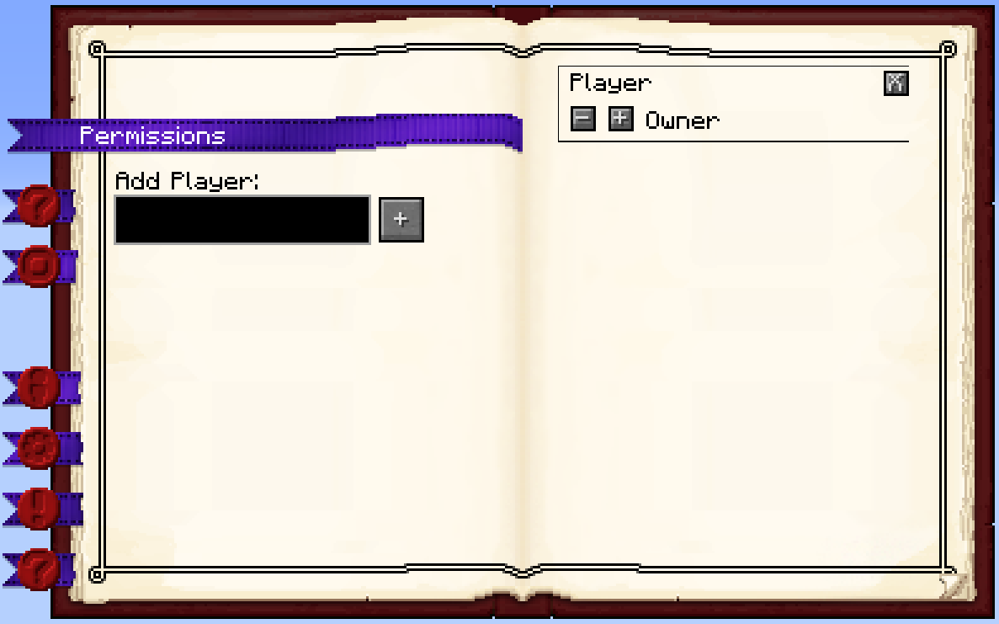
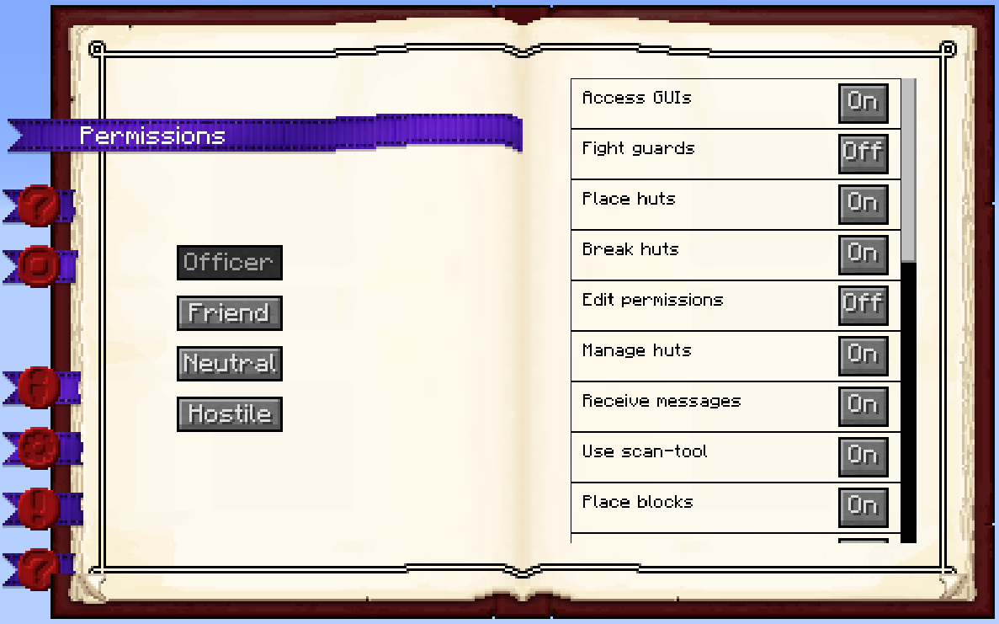
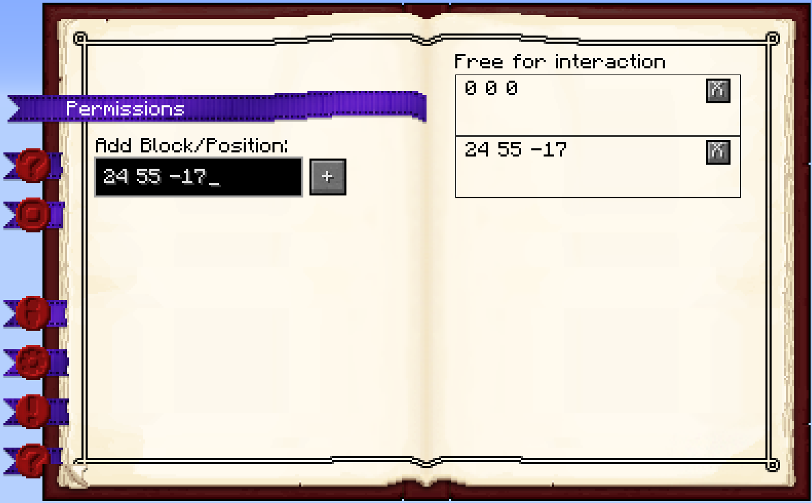
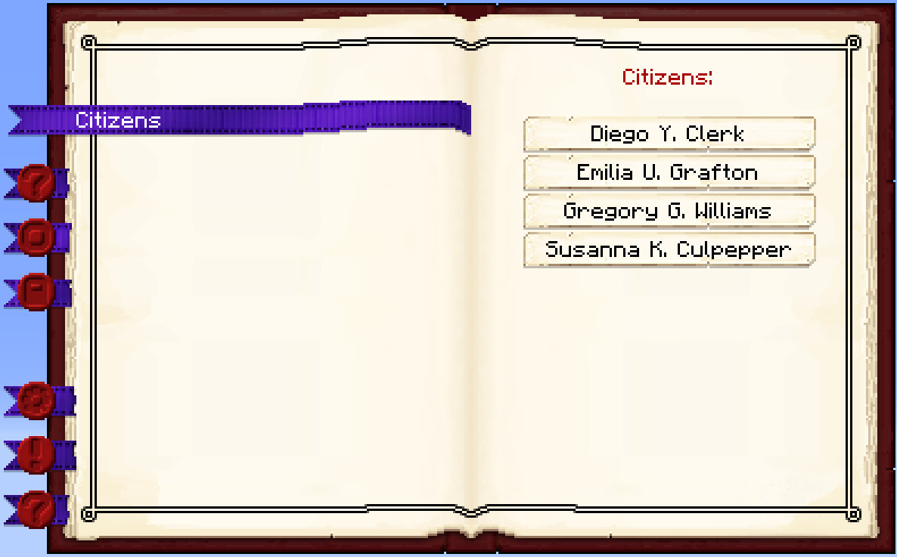
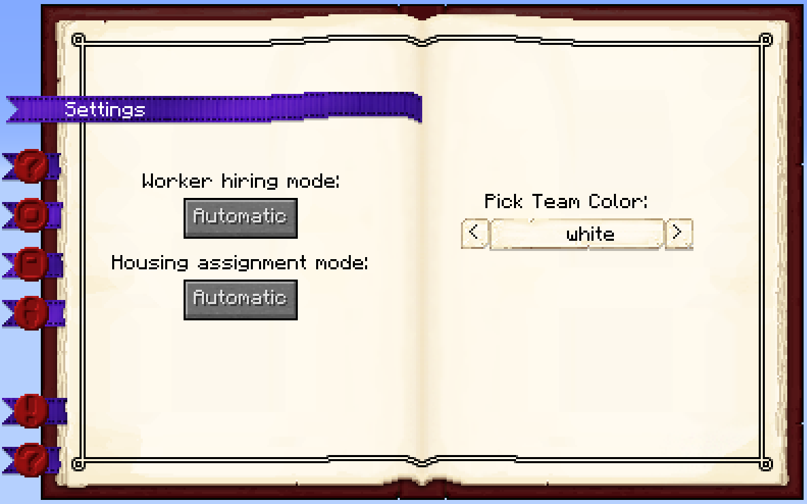
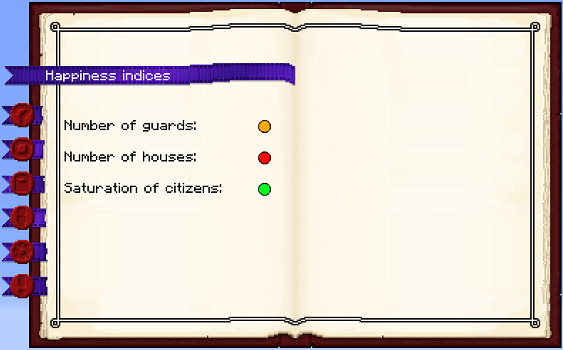
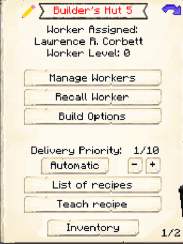

# Tutorial

<p class="h4 text-center"><b>Hello and welcome all new and old players!</b></p>

- [Quick Walkthrough](#quick-walkthrough)
  - [Step 1 Supply Camp / Supply Ship](step-1-supply-camp-/-supply-ship)
  - [Step 2 Townhall](step-2-townhall)
  - [Step 3 Builder](step-3-builder)
  - [Step 4 Lumberjack](step-4-lumberjack)
  - [Step 5 Miner](step-5-miner)
  - [Step 6 Food](step-6-food)
  - [Step 7 Rest of the Colony](step-7-rest-of-the-colony)
- [Detailed Walkthrough](#detailed-walkthrough)
  - [Placement of the Supply Ship or Supply Camp](#placement-of-the-supply-ship-or-supply-camp)
  - [Town Hall](#town-hall)
- [Setting Up Your Colony](#setting-up-your-colony)
  - [Step 1](#step-1)
  - [Step 2](#step-2)
  - [Town Hall GUI](#town-hall-gui)
  - [Step 3](#step-3)
  - [Step 4](#step-4)
  - [Final Notes](#final-notes)

This tutorial assumes you have already installed the mod or modpack. If you'd like instructions on how to <a id="install">install</a> our [Official Mod Pack](https://minecraft.curseforge.com/projects/minecolonies) you can find instructions for [here](../installation) 

## Quick Walkthrough 

Before you get started on your new colony you should find your perfect location. You need a large enough area for a full city.

You should also gather as many resources as you can. Once you figure out which style you want, you should start gathering enough wood for that style, as well as cobble, coal, iron, and even flowers, and some saplings for other trees not in your style as they are often used as decoration items.

You should also gather enough food to feed yourself and your initial citizens until you can get workers who gather and cook food. 

 
  ### Step 1 Supply Camp / Supply Ship
  
  Once you have your location determined, you must place a supply camp or supply ship, you can only place one of these, and only place it once. The supply camp and ship have the townhall block you need to officially start your colony, it also has some other supplies you may need during your building of the colony. Once you have the townhall block and the build tool, the remaining camp or ship is just decoration. You can leave it if you wish, or tear it down and use the blocks.
  
  ### Step 2 Townhall
  
  The Townhall building what what actually creates the colony. This is where you start using the build tool to place buildings. Using the build tool ensures you can see exactly where the building will be, which direction it will face and if it is at the right level, some buildings need raised to the correct level.
  Once the Townhall block is placed, you will start receiving the first 4 citizens.
  
  ### Step 3 Builder
  
  Before anything can be built, you need a builder. The builder must build his own hut before building any other huts. He also can not build a hut that will be a higher level than his own hut level.
  
  ### Step 4 Lumberjack
  
  If your style is wood, it's recommended to build a lumberjack next. That way they can start gathering wood for your next builds.
  
  ### Step 5 Miner
  
  Stone is another major need for any colony, so a mine is the next logical step.
  
  ### Step 6 Food
  
  The next major thing you need for your colony is food, the fastest way to get food is to get a fisherman. You could do a farmer or one of the herders but a fisherman is faster.
  
  ### Step 7 Rest of the Colony
  
  This is where you need to decide what you need next, based on how you play and what your colony needs. But you have several things to look at. Once you get five citizens you can get attacked by barbarians, or you may get a sick citizen and need to build a hospital, or you may decide you want a sawmill to make the needed items for your miner or builder. Or you may just want to have a specific worker, or you found a great place for a certain hut. From here on out, you decide how your colony will grow.
  
  <br>
  
## Detailed Walkthrough
<br>

If you're here, **CONGRATULATIONS!** You have already <a href="#install">installed</a> Minecolonies and are ready to embark on an adventure to explore, conquer and establish your own Settlement. Work hard and turn it into a thriving Town. Hone your Leader skills and grow grow grow into a City. Lastly, can you be a grand leader and finally achieve a Metropolis??? (Check your ingame Minecolonies Achievements).

<p style="text-align:center;"></p>

So, the first thing you want to do is find the perfect spot to settle down. But, before you do that, there are two things you have to consider. The following comments are the most important you should read and consider to ensure a successful Town and avoid frustration. Please read all considerations first, before placing your [Supply Ship](../items/supplyship) or [Supply Camp](../items/supplycamp). Even before starting to play:

**Hint:** The most important tool you will need for the entire mod is the Building Tool (check out our [Building Tool](../items/buildingtool) page). Craft the Building Tool so you can place all the buildings, worker huts and even the Supply Ship or Supply Camp in the perfect spot.

<p class="h4 text-center"><b>Build Tool Video.</b></p>

<div class="embed-responsive embed-responsive-16by9 mx-auto">
  <iframe class="embed-responsive-item" src="https://www.youtube.com/embed/DVGGDUXbTOY" allow="autoplay; encrypted-media" allowfullscreen></iframe>
</div>
<br />

### Placement of the Supply Ship or Supply Camp 

 When you place the [Supply Ship](../items/supplyship) it will spawn a chest that will contain the Town Hall block and the Building Tool. To place the Supply Ship, you need to have a large enough body of water. The Supply Ship is 32 x 11 blocks in length and width. So the recommended body of water must be at least (32 x 20). Use the Building Tool to see where the pShip will be placed and when you place the Supply Chest a chest will appear on the exact block you right clicked. The Chest will be directly in front of the ladder to board the supply ship (8 blocks from the boarding ladder) and the ladder is not in the middle of the Supply Ship. But please take into account the Town Hall placement as well before you place your Supply Ship. **Once the Supply Ship is placed, you can't place another Ship or Camp in this World anymore.**
 
(Hint: if you're not using the Building Tool and aren't able to place the Supply Ship, try it block by block: one to the right, left, closer or further from the water - or even directly over the water creating a walkway block by block).

 When you placed the [Supply Camp](../items/supplycamp) it will spawn a chest that will contain the Town Hall block and the Buiding Tool. To place the Supply Camp, you need to have a large enough flat, clear piece of land. The recommended flat piece of land must be at least 16 x 17 blocks in size. When you place the Supply Camp a chest will appear on the exact block you right clicked. But please take into account the Town Hall placement as well before you place your Supply Camp. **Once the Supply camp is placed, you can't place another Camp or Ship in this World anymore.**

(Hint: if you're not using the Building Tool and aren't able to place the Supply Camp, try it block by block: one to the right, left, closer or further from the area you cleared. It can not contain any holes or have any flowers, grass, fens, etc. It must be completely flat and clear.

### Town Hall

 The protected area of your Colony (once the [Town Hall](../../source/buildings/townhall) has been placed) will be a 8 chunks radius, measured from where you placed your Town Hall block the first time (Default config). Therefore, plan carefully where you want to place your Town Hall. 128 blocks (8 chunks x 8 chunks) in every direction will be your protected Town area including mountains, hills, lakes, oceans, caves, world generated structures, etc. from bedrock to the sky limit.

- **Note**: You can configure your own Town area radius in the configuration options of the mod or the the minecolonies.cfg file inside the ```../minecraft/config/``` folder of your own world. (see minecolonies config server section for details)

Due to the protected area of each Town, you have to scout carefully your surroundings to make sure you are clear of any other Towns nearby preventing you from placing your Town hall or limit your Town area in that direction.

If there is another Colony too close to your current position you won't be able to place a Town Hall.

If you want to know whether there is a colony too close to your current position we included some information in the debug screen (Displayed when you press the F3 button) which contains a real time tracker showing you the distance to the next colony, the colony you're currently in, or if there is no colony close at all plus - if there is a colony close to your current position - the required distance to place your Town Hall.

<p class="text-center"></p>

<p class="text-center"></p>

<p class="text-center"></p>

For example, in the official Minecolonies server it will be the default 8 chunk radius (8 + 8 + 1 {center Chunk where TownHall was placed} = 17 chunks or 272 total blocks required). It therefore, will tell you: "Next colony is XXX blocks away. (272 required to place a Colony)."


**Now, after you have explored, thought carefully, planned and found the perfect spot to start your own colony, let's take a look at the required steps to get your Colony running.**

## Setting Up Your Colony

### Step 1

Get enough materials and craft your Supply ship/Camp in a crafting table. Now place it with the <a href="#build_tool">Build Tool</a> or by right clicking a block with it to place your Supply Ship/Camp (which you can use as shelter, warehouse or even as materials to give to your builder). It will also give you a chest with your Town Hall block and a Build Tool after placement.

- **Hint:** Meanwhile, gather as many materials as possible to be able to give them to your builder when he starts building. He will be asking you for all kinds of materials he will need for each building or upgrade, depending on the style of building you have chosen. Mainly wood, cobblestone and torches for the starter builds. Further upgrades will require more elaborate materials.

### Step 2

After you have carefully decided where you want to place your Town Hall (Remember, the position where you placed the Town Hall block will be the center of your Town's protected area. Once placed, the area will be set and cannot be changed). Use your <a href="#build_tool">Build Tool</a> to place the Town Hall block, once you "commit" to the placement of the Town Hall, the Town hall block will be set and your Citizens will automagically appear. You can right click the Town Hall block to look at its graphical user interface.

### Town Hall GUI

*You may use the tabs on the left side to switch between different categories:*

<br>
<p><strong>Information: </strong>This is the overall information section of the Town Hall GUI</p>
   
<div class="row">
  <div class="col-sm-12 col-md">
    
  </div>
  <div class="col-sm-12 col-md">
    <br><br>
    <ul>
     <li><strong>Page 1: </strong>you will see some statistics on your Citizens: The number of Citizens you have and a listing of the unemployed and workers. It will show you how many and what type you have.</li>
     <br><br>
     <li><strong>Page 2: </strong>you will see the overall happiness of the Town's Citizens as well as any "Events" that the Town is having (future use atm).</li>
    </ul>
  </div>
</div>
<br>

<p><strong>Actions: </strong>This is the most important section. Here you will see your Town's name and the Buttons:</p>

<div class="row">
  <div class="col-sm-12 col-md">
   <br><br><br>
    
  </div>
  <div class="col-sm-12 col-md">
    <p><strong>Page 1: </strong>Here you will see the name of your Colony and the buttons:</p>
    <ul>
     <li><strong>Build Building/Switch Style.- </strong> The button will say; "Build Building" when no level has been built yet, then it will say; "Switch Style", so you can change the style (at same level you have currently) or also to "upgrade" to next level.</li>
     <li><strong>Repair Building.- </strong>So the builder can "restore" the building to it's original schematic, when alterations have changes something.</li>
     <li><strong>Recall Citizens.- </strong>So you can make <i>ALL</i> citizens (wokers or unemployed) to gather at the Town Hall block location, they will be teleported there. .</li>
     <li><strong>Toggle Specialization.- </strong>For future use, has no purpose at the moment.</li>
     <li><strong>Rename Colony.- </strong>To change the name of the Colony (from player's name) to anything you want, f.e. in coop play and everyone decides on a name.</li>
    </ul>
   <br>
   <p><strong>Page 2: </strong>This is for the PVP part of the mod, here you have:</p>
    <ul>
     <li><strong>Allies.- </strong>Other Colonies that you have added as "Allies" and they have confirmed your Colony as ally as well.</li>
     <li><strong>Feuds.- </strong>Other Colonies that you have added as "Feud" and they have confirmed your Colony as feud as well.</li>
    </ul>
  </div>
</div>
<br>

<p><strong>Permissions: </strong>Here you can invite other players to your Town to collaborate. You can add a player and give him a <i>Rank</i> in your Town. Each Rank will have certain privileges in the protection system that you can configure. Also you can set individual players as "Hostile".</p>

<div class="row">
  <div class="col-sm-12 col-md">
    
  </div>
  <div class="col-sm-12 col-md">
    <ul>
     <br><br>
     <li><strong>Page 1: </strong>Here you can type the name of the player you want to add to your list and grant them certain permissions.</li>
     <br><br>
     <li><strong>Page 2: </strong>It shows you the list of players that have ben added as well as their current rank. You can click on the "-" or "+" to give them more rank or less rank.</li>
    </ul>
  </div>
</div>
<br>

<p><strong>Permissions Pg. 3 & 4: </strong>Here you check and manage the individual permissions for each Rank.</p>

<div class="row">
  <div class="col-sm-12 col-md">
    
  </div>
  <div class="col-sm-12 col-md">
    <ul>
     <br><br>
     <li><strong>Page 3: </strong>Here are the buttons for you to select each "Rank" that you would like to view and manage the individual permissions for.</li>
     <br><br>
     <li><strong>Page 4: </strong>Here are the individual permissions (for the rank you have selected on the previous page) tha you can toggle <i>ON</i> or <i>OFF</i>, giving each rank the permission <b>you</b> want.</li>
    </ul>
  </div>
</div>
<br>

<p><strong>Permissions Pg. 5 & 6: </strong>In this section you can add a certain block's position that will bypass the protection system for "interaction". Any player will be able to interact with that block regardless of having a rank or not in your Colony.</p>

<div class="row">
  <div class="col-sm-12 col-md">
    
  </div>
  <div class="col-sm-12 col-md">
    <ul>
     <br><br>
     <li><strong>Page 5: </strong>The field where you can enter the position (X, Y, Z) of the block that you want to make "Free for interaction".</li>
     <br><br>
     <li><strong>Page 6: </strong>Here you will see the list of block positions that you have added as free for interaction.</li>
    </ul>
  </div>
</div>
<br>

<p><strong>Citizens: </strong>This section just displays the names of the citizens in your Colony.</p>

<div class="row">
  <div class="col-sm-12 col-md">
    
  </div>
  <div class="col-sm-12 col-md">
    <ul>
     <br><br>
     <li><strong>Page 1: </strong>Blank page except for the header (future use).</li>
     <br><br>
     <li><strong>Page 2: </strong>Here you will see the list of names of the citizens in your Colony.</li>
    </ul>
  </div>
</div>
<br>

<p><strong>Settings: </strong>This section is where you can control how your Citizens will be hired and assigned housing in your Colony.</p>

<div class="row">
  <div class="col-sm-12 col-md">
   <br><br>
    
  </div>
  <div class="col-sm-12 col-md">
    <ul>
     <li><strong>Page 1: </strong>There are two buttons here:</li>
       <ul>
        <li><strong>Worker hiring mode: </strong>Clicking on this button you can switch between automatic or manual. If it's in automatic mode, you can't fire or hire any Citizen from any Worker's hut and the best "unemployed" citizen will be hired for you. In manual mode you will be able to <i>Hire</i> and <i>Fire</i> which ever citizen you want at any time.</li>
        <li><strong>Housing assignment mode: </strong>Clicking on this button you can switch between automatic or manual. if it's in automatic mode the citizens will be assigned as soon as they are spawned and housing is available. In manual mode, you can select which Citizen will be housed at in each Citizen Hut (this is specially better if you have a large Colony and many workers spread out in a large area, so they are housed as close as possible to the workplace).</li>
       </ul>
     <br>
     <li><strong>Page 2: </strong>Pick team Color: What ever color you pick from here, your guards will have a "glow", of this color, around them when you place them in "follow" mode. this is for the PVP system, so you know which are your guards when you are fighting. </li>
    </ul>
  </div>
</div>
<br>

<p><strong>Work Orders: </strong>Here you will see the work orders the [Builder](../../source/workers/builder) has in the order they have been assigned. The builder will not start another order until he has successfully completed the top one.</p>

<div class="row">
  <div class="col-sm-12 col-md">
    
  </div>
  <div class="col-sm-12 col-md">
    <ul>
     <br><br>
     <li><strong>Page 1: </strong>Blank page except for the header (future use).</li>
     <br><br>
     <li><strong>Page 2: </strong>Here are all the <i>Build</i> orders listed, that have been created by you (including decorations and your own schematics as well as the mod's buildings). The builder will complete the builds in that order, from top to bottom. Here you can <i>Manage</i> the priority of the builds and even delete work orders. When you delete a work order which is currently being built the builder will stop building and will continue where he left off when you create the build/upgrade order again.</li>
    </ul>
  </div>
</div>
<br>

<p><strong>Happiness: </strong>This is the section for the global happiness of your Town, so you can see what area needs more attention to raise the happiness level.</p>

<div class="row">
  <div class="col-sm-12 col-md">
    
  </div>
  <div class="col-sm-12 col-md">
    <ul>
     <br><br>
     <li><strong>Page 1: </strong>The happiness indices. You can keep track of the 3 main areas that will lower or raise the happiness of your Town. There are 3 colors; Green (everything is fine), Orange (needs attention it's below optimal level), Red (Immediate attention is needed - it's in critically low level).</li>
     <br><br>
     <li><strong>Page 2: </strong>Intentionally blank for now.</li>
    </ul>
  </div>
</div>
<br>

### Step 3

Before any building can be built, you have to craft the "[Builder's hut](../buildings/builder)" block in the crafting table and use your <a href="#build_tool">Build Tool</a> to place his building. Once you "commit" to the placement of the builder's hut, the block will be placed and the builder will be automatically assigned (or you can manually assign one with the best "traits" for builder if you changed this in the setting tab in the Town Hall's GUI).
You now officially have a [Builder](../../source/workers/builder)! CONGRATULATIONS!
Now you can access the Builder's block (right click on it) and you will see a similar GUI with different options:

<div class="row">
  <div class="col-sm-12 col-md">
    
  </div>
  <div class="col-sm-12 col-md">
    <p>The Worker assigned and their Level. (The worker levels up in time by doing their work. The higher the level the faster and more efficient they will be). And the buttons:</p>
    <ul>
      
        <li><strong>{{ item.button }}:</strong> {{ item.content }}</li>
      
    </ul>
  </div>
</div>

You will have to issue the builder the "Build" assignment so he can build his own Hut first. Without the builder's hut being built, the builder cannot build any other buildings. He will be asking for the materials he/she needs. Make sure to check the chat regularly to see what materials the builder is requesting for any build/upgrade.

- **Hint:** If you see he/she has not finished a work order and you don't see the builder asking for any materials, go to the builder's hut and recall the builder and wait a bit to see what he/she needs. Also check Pg. 2 of the Builder's Hut GUI and see what resources are in red color, those are missing resources.

### Step 4

Once the builder has finished his Hut, you're ready to start building ANY other building you want. Just craft the desired block and use your build tool to place the desired building and go into the GUI for that new block you just placed, right click on it and click on the "Build" button. That simple!

- **Hint:** Consider Upgrading the Builder's hut to level 2 as soon as you can so he may be able to upgrade any other building.

### Final Notes

You have now completed the most important steps completed to start and create your Colony.

From this point on, you should be able to place, build, upgrade and manage all your buildings and Citizens.

Your questions from this point on are probably what to build next? The [Town Hall](../../source/buildings/townhall), [Mine](../buildings/mine), [Sawmill](../buildings/sawmill), [Farm](../buildings/farm), [Fisherman](../buildings/fisherman), [Guard Tower](../buildings/guardtower), [Deliveryman](../buildings/deliveryman), [Bakery](../buildings/bakery), etc.? Well, there are many answers, but you start with only 4 citizens! Now what? Well the next step after your 4 Citizens are employed and are working hard, is to plan and place the "[Citizen Hut](../buildings/citizenhut)". This will give you additional Citizens for each level of a [Citizen Hut](../buildings/citizenhut) you build in your Town! That's crazy, right? Now what do you do with so many Citizens? You cannot assign more than 1 worker per building. Therefore, consider building additional buildings (more miners, lumberjacks, builders, farmers, fishermen... and more to come!). Check the [Citizen Hut](../buildings/citizenhut) section for more detailed info.

_**There are other buildings that will also "spawn" more citizens for you as well:**_
- The [Town Hall](../../source/buildings/townhall) will spawn and house 1 Citizen per level built.
- The [Barracks](../buildings/barracks) will spawn and house 1 Citizen per level of each of it's Towers' level built.

- **Hint:** Upgrade your buildings to the highest level each one has to unlock achievements (and in the future enable your worker to do more stuff).
