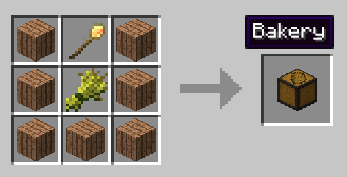
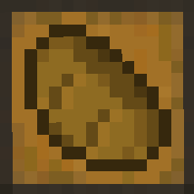

# Baker

The Baker is another part of the your town's bloodline. The baker will craft bread, cake and make cookies to provide for all your workers' needs. The baker will be making bread in the furnace, provided that the [Deliveryman](../workers/deliveryman) (or yourself) give it all the wheat to do it. The Baker will also craft a cake or cookies if you provide it with the appropriate ingredients (currently the Deliveryman will not deliver the items required for crafting cakes or cookies, these have to be provided by the player). 

Before you choose a place to build the Baker's hut, take into account the location from the Warehouse and/or Farmer(s). After you have selected a place for the hut you have to craft the Baker's Hut and place it with the [Building Tool](../../source/tutorials/building_tool).  Once you "commit" to the placement of the Baker's Hut, the block will be placed and the Baker will  be automatically assigned (or you can manually assign one with the best [Traits](../../source/tutorials/worker_info) for a Baker if you changed this in the setting tab in the [Town Hall's GUI](../../source/buildings/townhall).

Best Traits are: **Intelligence** and **Dexterity**.

        

You now officially have a Baker, **CONGRATULATIONS!**

Now that you have a Baker they can start crafting bread, cakes and cookies right away. Once the build is done, you should think about upgrading the baker’s hut so that the worker can craft more bread, cakes and cookies at a faster pace. 

## Hut GUI

When accessing the Baker's Hut block (right clicking on it) you will see a GUI with different options:

  

    
  

  

     
     
    
The Worker assigned and their Level. (The worker levels up in time by doing their work. The higher the level the faster and more efficient they will be). And the buttons:

    <ul>
      
        <li><strong>{{ item.button }}:</strong> {{ item.content }}</li>
      
    </ul>
  

