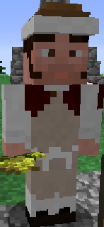
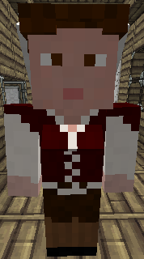

# Baker

&nbsp;&nbsp;&nbsp;

  

    

      
<strong>Primary Trait:</strong>

      
<strong>Secondary Trait:</strong>

      
<strong>Building:</strong>

    

    

      
Intelligence

      
Dexterity

      
<a href="../buildings/bakery">Bakery</a>

    

  

Welcome to the Baker’s Information Site.

The Baker is a part of the your Town's food production line. The baker will craft bread, cake, pies and make cookies to provide your workers' with baked goods. The baker will be making bread in the furnace, provided that the [Deliveryman](../workers/deliveryman) (or yourself) give it all the wheat to do it. The Baker will also craft a cake or cookies if you provide it with the appropriate ingredients. 

Click here for full information about the [Baker's hut](../buildings/bakery) block and using your [Building Tool](../items/buildingtool). Once the hut is placed, the Baker will be automatically assigned (or you can manually assign one with the best [Traits](../systems/workerinfo) for a Baker if you changed this in the setting tab in the [Town Hall's GUI](../../source/buildings/townhall).

You now officially have a Baker, **CONGRATULATIONS!**

Now you will have to issue the builder the “Build” assignment so it can build the “Baker’s Hut”.

Once the builder is done the Baker can start crafting bread, cakes and cookies right away. You should think about upgrading the baker’s hut so that the worker can craft more bread, cakes and cookies at a faster pace. 
