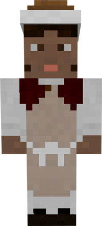

# Baker

&nbsp;&nbsp;&nbsp;

  

    

      
<strong>Primary Trait:</strong>

      
<strong>Secondary Trait:</strong>

      
<strong>Building:</strong>

    

    

      
Knowledge

      
Dexterity

      
<a href="../buildings/bakery">Bakery</a>

    

  

Welcome to the Baker’s Information Site.

The Baker is an important part of the food production part of the your Colony. The baker will craft bread, cake, pie and make cookies to provide for your workers. The baker will be making bread in the furnace, provided that the [Deliveryman](../workers/deliveryman) (or yourself) give it all the wheat to do it. The Baker will also craft a cake, pie or cookies if you provide it with the appropriate ingredients.

Click here for full information about the [Baker's hut](../buildings/bakery) block and using your [Building Tool](../items/buildingtool). Once the hut is placed, the Baker will be automatically assigned (or you can manually assign one with the best [Traits](../systems/workerinfo) for a Baker if you changed this in the setting tab in the [Town Hall's GUI](../../source/buildings/townhall).

You now officially have a Baker, **CONGRATULATIONS!**
