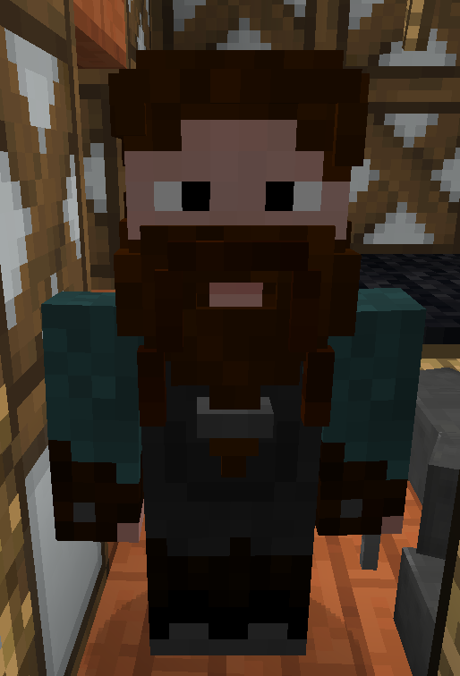
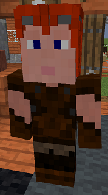

# Blacksmith

&nbsp;&nbsp;&nbsp;

  

    

      
<strong>Primary Trait:</strong>

      
<strong>Secondary Trait:</strong>

      
<strong>Building:</strong>

    

    

      
Strength

      
Endurance

      
<a href="../buildings/blacksmith">Blacksmith</a>

    

  

Welcome to the Blacksmith’s Information Site.

The Blacksmith is another part of your Town’s bloodline. The blacksmith will craft tools, swords and armor to supply workers and knights and rangers with tools and weapons. (However, they do not craft bows.) The delivery man, or the player must provide the necessary supplies to make these items.

Blacksmith can learn 3x3 recipes for things made entirely out of ingots or metal blocks, all tools and weapons without string or redstone, and all armour! The blacksmith will only make items when they have been taught the recipes and receive a request for a tool, armor or sword.

Click here for full information about the [Blacksmith's hut](../buildings/blacksmith) block and using your [Building Tool](../items/buildingtool). Once the hut is placed, the Blacksmith will be automatically assigned (or you can manually assign one with the best [Traits](../systems/workerinfo) for a Blacksmith if you changed this in the setting tab in the [Town Hall's GUI](../../source/buildings/townhall).

You now officially have a Blacksmith, **CONGRATULATIONS!**

Now you will have to issue the builder the “Build” assignment so it can build the “Blacksmith’s Hut”.

Once the builder is done the Blacksmith can start crafting tools, armor and swords, once you teach them the necessary recipes. You should think about upgrading the Blacksmith’s hut so that the worker can craft more items.

**Note:** The Blacksmith can only learn a set number of recipes based on the Hut level. So:

| Building Level | Recipes |
| ----- | ----- |
| 1 | 10  |
| 2 | 20  |
| 3 | 40  |
| 4 | 80  |
| 5 | 160 |

 
