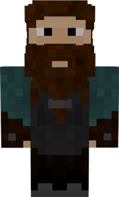
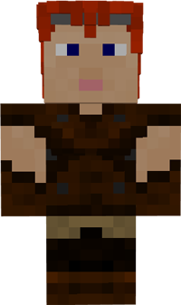

# Blacksmith

&nbsp;&nbsp;&nbsp;

  

    

      
<strong>Primary Trait:</strong>

      
<strong>Secondary Trait:</strong>

      
<strong>Building:</strong>

    

    

      
Strength

      
Focus

      
<a href="../buildings/blacksmith">Blacksmith</a>

    

  

Welcome to the Blacksmith’s Information Site.

The Blacksmith is a part of your Colony's production line. The blacksmith will craft tools, swords and armor to supply workers, knights, and rangers with tools and weapons. (However, they do not craft bows or fishing poles.) A deliveryman or the player must provide the necessary supplies to make these items.

Blacksmith can learn 3x3 recipes for all tools and weapons without string or redstone, and all armour! The blacksmith will only make items when they have been taught the recipes and receive a request for a tool, armor or sword.

Click here for full information about the [Blacksmith's hut](../buildings/blacksmith) block and using your [Building Tool](../items/buildingtool). Once the hut is placed, the Blacksmith will be automatically assigned (or you can manually assign one with the best [Traits](../systems/workerinfo) for a Blacksmith if you changed this in the setting tab in the [Town Hall's GUI](../../source/buildings/townhall).

You now officially have a Blacksmith, **CONGRATULATIONS!**

**Note:** The Blacksmith can only learn a set number of recipes based on the Hut level. So:

| Building Level | Recipes |
| ----- | ----- |
| 1 | 10  |
| 2 | 20  |
| 3 | 40  |
| 4 | 80  |
| 5 | 160 |

 
