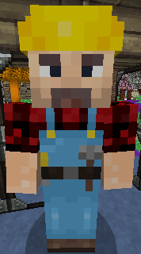
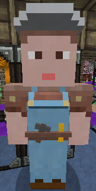
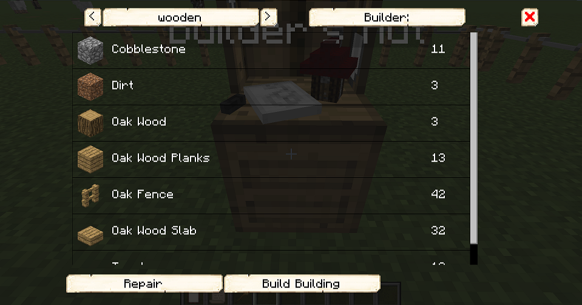

# Builder

&nbsp;&nbsp;&nbsp;

  

    

      
<strong>Primary Trait:</strong>

      
<strong>Secondary Trait:</strong>

      
<strong>Building:</strong>

    

    

      
Adaptability

      
Athletics

      
<a href="../buildings/builder">Builder's Hut</a>

    

  

The Builder is the **MOST** important worker in your colony. As long as you provide the Builder with all the resources they ask for, they will build and upgrade all of your town buildings, workers' huts, decorations, and your personal schematics.

## Building A Hut/Schematic
**Before you build *any* building, you need to build the Builder's Hut. If the Builder’s Hut isn't built, the Builder cannot build any other building.**
Buildings are constructed after the hut block/schematic is placed using the Building Tool and the green checkmark clicked. If it is a hut, you must right-click on the hut block, click Build Options, and then click Build Building. Only then will a build request be created (indicated in chat). An available Builder will accept the request (also noted in chat), and head off to clear the land and start building. They will stop building if they run out of materials and will then head back to their hut and request more.

## Notes
- The Builder will not start another build assignment until they have finished the current one.
- The Builder can *ONLY* upgrade other huts to the level of their Builder’s Hut. Upgrade the Builder’s Hut to further upgrade other buildings.
- You can rearrange the priority and cancel the build requests in the <a href="../../source/buildings/townhall">Town Hall</a> GUI under the Work Orders symbol (!).
- The Builder will collect any blocks they remove and deposit them in their hut inventory and any <a href="../../source/items/rack">racks</a>/chests in their hut. Items are never lost or destroyed.

If you see the Builder has not finished building/upgrading any build order and they aren't asking for any materials, go to the Builder’s Hut and recall the Builder and wait a bit to see what they need. You can also go to page 2 of the Builder’s Hut GUI and check the list of materials required. Any material in the list that is missing will be in red.

If a build request is created but no Builder starts building, the building may be out of their range (which is 100 blocks from their hut). Cancel the build order, then go to Build Options of the hut you want to be built and manually assign a Builder (top right).

If the build order is within their range and they still aren't building it, check if you've set them to Manual on the third page of their hut GUI. If you have, you'll need to choose build orders for them yourself (also in the third page of their hut GUI).

The higher a Builder's Adaptability skill, the faster they'll place blocks. Similarly, the higher their Athletics skill, the faster they'll break blocks.

## Build Options Details

### Before Hut is Built

  

    
  

  

    <ul>
      <ul><strong>Style (top left): </strong> Here you can verify the style of schematics you have currently. You can change the style to see the list of items required for other styles, but it's not recommended that you change a different style from here since it will most likely be in a different position (since each schematic is different).</ul>
      <ul><strong>Builder: </strong> Here is where you can choose what Builder you want on the project. If it is out of your Builders' range, this is where you can manually assign one.</ul>
      <ul><strong>List: </strong>This is the list of resources that the Builder will need for the schematic style selected.</ul>
       <ul><strong>Repair: </strong> Not needed, as the building hasn't been built yet.</ul>
      <ul><strong>Build Building: </strong>This is where you tell the Builder to build the building with the style selected.</ul>
    </ul>
  

 

### After Hut is Built

  

    
  

  

    <ul>
       <ul>
      
        <li><strong>{{ item.button }}:</strong> {{ item.content }}</li>
      
    </ul>
    </ul>
  

