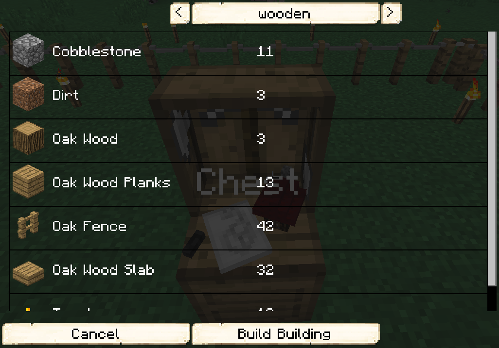
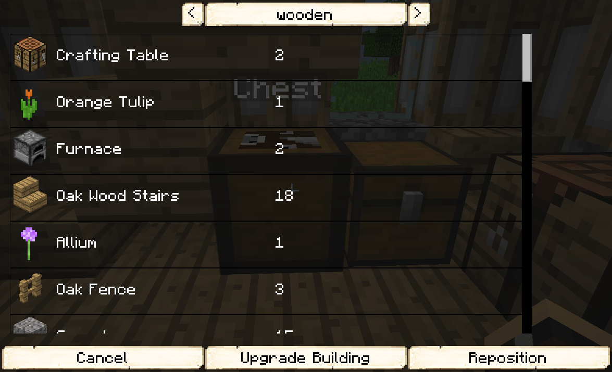

# Builder

  

    

      
<strong>Primary Trait:</strong>

      
<strong>Secondary Trait:</strong>

      
<strong>Building:</strong>

    

    

      
Strength

      
Endurance

      
<a href="../buildings/builder">Builder's Hut</a>

    

  

Welcome to the Builder’s Information Site.

The builder is the *most* important workers for your colony. As long as you provide the builder with all the resources it asks for, the builder will build and upgrade all of your town buildings, workers' huts, decorations and your schematics. 

**Before you build *any* building, you need to build the Builder's Hut. Without the builder’s hut being built, the builder cannot build any other buildings.**

Before you choose a place to build his Hut, take into account the distances among the other buildings and obstacles like water, trees, caves, mountains, lava sources, etc. After you have selected a place for the Hut, you have to craft the Builder’s Hut block and place it with your [Building Tool](../../source/tutorials/building_tool). Once the hut is placed, the builder will be automatically be assigned (or you can manually assign one with the best [Traits](../../source/tutorials/worker_info) for a builder if you changed this in the settings tab in the [Town Hall's GUI](../../source/buildings/townhall).

You now officially have a builder, **CONGRATULATIONS!**

Now you will have to issue the builder the “Build” assignment so he can build their own hut first. He will be asking for the materials he/she needs. Make sure to check the “chat” regularly to see what materials the builder is requesting for any build/upgrade.

Hint: If you see the builder has not finished building/upgrading your Builder’s hut and you don’t see the builder asking for any materials, go to the builder’s hut and “recall” the builder and wait a bit to see what the builder needs. Watch the Minecraft “chat” section. Also you can go to page 2 of the builder’s hut GUI and check the list of materials required, any material in the list that is still missing will be in red colored letters.

Once the builder is done you can now hire the Builder and it will start to build anything you order him to build for you; Worker huts, buildings, decorations or your own schematics for your Town.

- **Note:** The Builder may *ONLY* build or upgrade any other Worker's hut up to the level of it's own hut. So, in order for the builder to upgrade any building, the Builder's Hut *MUST* be upgraded first. Then they will be able to upgrade any other building(s).

## Hut GUI

When accessing the Builder’s Hut block (right clicking on it) you will see a GUI with different options:

  

    
  

   
  
  
    
The Worker assigned and their Level. (The worker levels up in time by doing their work. The higher the level the faster and more efficient they will be). And the buttons:

    <ul>
      
        <li><strong>{{ item.button }}:</strong> {{ item.content }}</li>
      
    </ul>
  

 

  

    
  

  
    
    
By pressing the arrow button in the top right corner of the GUI, you will be taken to page 2 of the GUI where you will find the following:

    <ul>
      <li><strong>Required Resources:</strong> These are the resource that the Builder will need for the Build/Upgrade they are currently working on. This amount will change as they place the materials and will show <strong>only</strong> what materials they still need to place. The blocks in Red color are the ones neither you nor the builder has in it's inventory</li>  
      <li><strong>Inventory:</strong> Same as above, allows you to view the huts storage.</li>
    </ul>
  

 

<b>Important Note:</b> After pressing the <i>Build</i> button you will see a new list of all the items required for that build. There are some options here, but the most important option you <i>HAVE To CONFIRM</i> the Build by pressing the <b>Build Building</b> button so the build order is created.

 

  

    
  

  
    
    
After pressing the Build button on page 1 you now have a few options to consider:

    <ul>
      <li><strong>Schematic Style:</strong> (Wooden in this image) Here you can verify the "style' of schematics you have selected from the build tool GUI on placement. You can change the style to see the list of items required for other styles, but it's not recommended that you build a different style from here since it will most likely be in a different position. Since each schematic is different.</li>
      <li>This is the list of resources that the Builder will need for the schematic style selected.</li>
      <li><strong>Cancel Button</strong> To cancel this view screen and go back to the Builder's Hut GUI page 1.</li>
      <li><strong>Build Building Button</strong> When you are ready to "commit" to the build of this selected schematic style.</li>
    </ul>
  

 

<b>Important Note:</b> After pressing the <i>Upgrade</i> button you will see a new list of all the items required for that build. There are some options here, but the most important option you <i>HAVE To CONFIRM</i> the Build by pressing the <b>Upgrade Building</b> button so the build order is created.

 

  

    
  

  
   
    
After pressing the Upgrade button on page 1 you now have a few options to consider:

    <ul>
      <li><strong>Schematic Style:</strong> (Wooden in this image) Here you can verify the "style' of schematics you have selected from the build tool GUI on placement. You can change the style to see the list of items required for other styles, but it's not recommended that you build a different style from here since it will most likely be in a different position.</li>
      <li>This is the list of resources that the Builder will need for the schematic style selected.</li>
      <li><strong>Cancel Button</strong> To cancel this view screen and go back to the Builder's Hut GUI page 1.</li>
      <li><strong>Upgrade Building Button</strong> When you are ready to "commit" to the build of this selected schematic style.</li>
      <li><strong>Reposition Button</strong> To Move the building from it's current location. After pressing this button you will be taken to the 3D view of the building tool GUI so you can move it to where you want it.</li>
    </ul>
  

  

## A few things to consider

For the placement of the Builder's Hut, you should consider having the hut in the middle of where you plan to have the rest of your buildings so that the builder has less of a distance to walk between it's hut and the build sites.

The builder will not start another build assignment until they have finished the current one.

You can go to the [Town Hall](../../source/buildings/townhall) and click on the Work Orders tab and cancel the current build as well as arrange the priorities of the following build orders. If you cancel a work order, when you assign the build again, the builder will continue where they left off.

Any block the builder removes (dirt, wood, planks, glass, etc.) while building and/or upgrading they will keep in their inventory until their inventory becomes full, or they may dump unnecessary items at the end of a build/upgrade.
