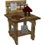
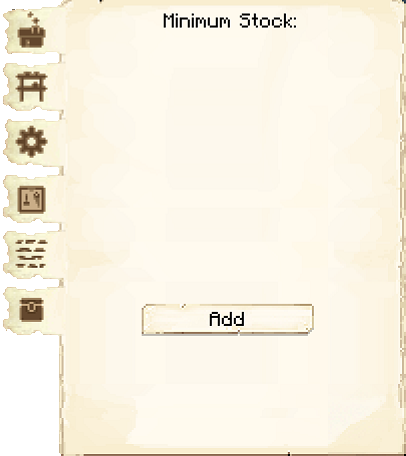

# Builder

The builder is the *most* important workers for your colony. As long as you provide the builder with all the resources it asks for, the builder will build and upgrade all of your town buildings, workers' huts, decorations and your schematics. 

Before any building can be built, you have to craft the Builder’s Hut block and place it with your [Building Tool](../../source/tutorials/building_tool). Once the hut is placed, the builder will be automatically be assigned (or you can manually assign one with the best [Traits](../../source/tutorials/worker_info) for a builder if you changed this in the settings tab in the [Town Hall's GUI](../../source/buildings/townhall).

Best Traits are: **Strength** and **Endurance**.

        

You now officially have a builder, **CONGRATULATIONS!**

Now you will have to issue the builder the build assignment so they can build their own hut first. Without the builder’s hut being built, the builder cannot build any other buildings.

## Hut GUI

When accessing the Builder’s Hut block (right clicking on it) you will see a GUI with different options:

  

    
  

  

    
The Worker assigned and their Level. (The worker levels up in time by doing their work. The higher the level the faster and more efficient they will be). And the buttons:

    <ul>
      
        <li><strong>{{ item.button }}:</strong> {{ item.content }}</li>
      
    </ul>
  

  

    
  

  
   
    
By pressing the arrow button in the top right corner of the GUI, you will be taken to page 2 of the GUI where you will find the following:

    <ul>
      <li><strong>Required Resources:</strong> These are the resource that the Builder will need for the Build/Upgrade they are currently working on. This amount will change as they place the materials and will show <strong>only</strong> what materials they still need to place. The blocks in Red color are the ones neither you nor the builder has in it's inventory</li>  
      <li><strong>Inventory:</strong> Same as above, allows you to view the huts storage.</li>
    </ul>
  

  

## A few things to consider

For the placement of the Builder's Hut, you should consider having the hut in the middle of where you plan to have the rest of your buildings so that the builder has less of a distance to walk between it's hut and the build sites.

The builder will not start another build assignment until they have finished the current one.

You can go to the [Town Hall](../../source/buildings/townhall) and click on the Work Orders tab and cancel the current build as well as arrange the priorities of the following build orders. If you cancel a work order, when you assign the build again, the builder will continue where they left off.

Any block the builder removes (dirt, wood, planks, glass, etc.) while building and/or upgrading they will keep in their inventory until their inventory becomes full, or they may dump unnecessary items at the end of a build/upgrade.

- **Note:** The Builder may *ONLY* build or upgrade any other Worker's hut up to the level of it's own hut. So, in order for the builder to upgrade any building, the Builder's Hut *MUST* be upgraded first. Then they will be able to upgrade any other building(s).
