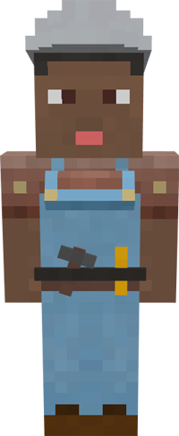

# Builder

&nbsp;&nbsp;&nbsp;

  

    

      
<strong>Primary Trait:</strong>

      
<strong>Secondary Trait:</strong>

      
<strong>Building:</strong>

    

    

      
Strength

      
Endurance

      
<a href="../buildings/builder">Builder's Hut</a>

    

  

Welcome to the Builder’s Information Site.

The builder is the *most* important worker in your colony. As long as you provide the builder with all the resources it asks for, the builder will build and upgrade all of your town buildings, workers' huts, decorations and your personal schematics. 

**Before you build *any* building, you need to build the Builder's Hut. Without the builder’s hut being built, the builder cannot build any other building.**

Click here for full information about the [Builder's hut](../../source/buildings/builder) block and using your [Building Tool](../items/buildingtool). Once the hut is placed, the builder will be automatically assigned (or you can manually assign one with the best [Traits](../systems/workerinfo) for a builder if you changed this in the settings tab in the [Town Hall's GUI](../../source/buildings/townhall).

You now officially have a builder, **CONGRATULATIONS!**

- **Note:** The Builder may *ONLY* build or upgrade any other Worker's hut up to the level of it's own hut. So, in order for the builder to upgrade any building, the Builder's Hut *MUST* be upgraded first. Then it will be able to upgrade any other building(s).  

## A few things to consider  

The builder will not start another build assignment until it has finished the current one.

You can go to the [Town Hall's GUI](../../source/buildings/townhall) and click on the Work Orders tab and cancel the current build as well as arrange the priorities of the other build orders you have there. If you cancel a work order, (and it was being built already) when you assign the build order again, the builder will continue where it left off.

Any block the builder removes (dirt, wood, planks, glass, etc.) while building and/or upgrading it will keep it in it's inventory until the inventory becomes full, or it may dump any unnecessary items at the end of a build/upgrade into the Builder's Hut Inventory.

**Hint:** If you see the builder has not finished building/upgrading any build order and you don’t see the builder asking for any materials, go to the builder’s hut and “recall” the builder and wait a bit to see what the builder needs. Watch the Minecraft “chat” section. Also you can go to page 2 of the builder’s hut GUI and check the list of materials required, any material in the list that is still missing will be in red colored letters.  

After pressing the <b>Build Options</b> button you have a few options to consider:
  

## Hut's Build Options Before Hut is Built  

  

    
  

  

    <ul>
      <ul><strong>Schematic Style: </strong> Here you can verify the "style' of schematics you have currently. You can change the style to see the list of items required for other styles, but it's not recommended that you change a different style from here since it will most likely be in a different position. Since each schematic is different.</ul>
      <ul><strong>Builder: </strong> Here is where you can choose what builder you want on the project. If it is out of a builders range, this is where you can manually assign one.</ul>
      <ul><strong>List: </strong>This is the list of resources that the Builder will need for the schematic style selected.
Repair: This is to repair a building back to it's current level according to the schematic. This will remove any changes that a player has made to the current building.</ul>
      <ul><strong>Repair: </strong> If you need to repair the build but this is not needed when the building isn't built yet.</ul>
      <ul><strong>Build Building: </strong>This is where you tell the builder to build the building for the first time.</ul>
    </ul>
  

  

## Hut's Build Options After Hut is Built  

  

    
  

  

    <ul>
       <ul>
      
        <li><strong>{{ item.button }}:</strong> {{ item.content }}</li>
      
    </ul>
    </ul>
  

