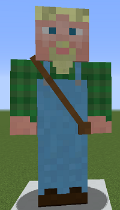
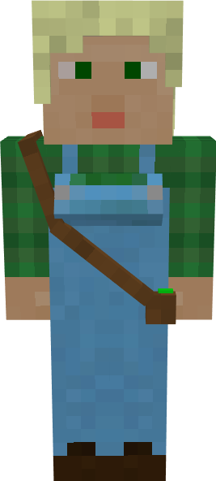

# Chicken Farmer

&nbsp;&nbsp;&nbsp;

  

    

      
<strong>Primary Trait:</strong>

      
<strong>Secondary Trait:</strong>

      
<strong>Building:</strong>

    

    

      
Adaptability

      
Agility

      
<a href="../buildings/chickenfarmer">Chicken Farmer's Hut</a>

    

  

The Chicken Farmer is a crucial part of your colony's food production needs. They will also provide you with all drops and byproducts like eggs and feathers. The Chicken Farmer will breed and butcher chickens for you as long as you provide them with seeds and an axe.

**NOTE:** The Chicken Farmer will not catch and bring in any chickens, only breed and butcher the ones in their hut area, so make sure you provide them with at least 2 initial chickens.

The Chicken Farmer will work with vanilla Minecraft chickens, but might work with some chickens from other mods as long as they are *coded* as chickens and have normal breeding behavior. They will collect anything that is modified by another mod as well, so if another mod changes the drops (for example) to include bones or another type of meat, the Chicken Farmer will collect these as well.

**Note:** The Chicken Farmer will only keep alive 2 chickens per hut level, so when their hut is level 5 they will have 10 chickens in their holding pens to breed and butcher. This means they will produce meats and byproducts faster.

| Hut Level | Chickens Housed |
| --------- | --------------- |
| 1         | 2               |
| 2         | 4               |
| 3         | 6               |
| 4         | 8               |
| 5         | 10              |

 
