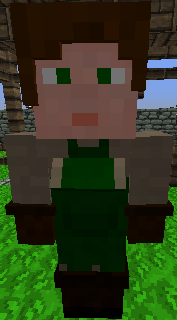

# Composter

&nbsp;&nbsp;

  

    

      
<strong>Primary Trait:</strong>

      
<strong>Secondary Trait:</strong>

      
<strong>Building:</strong>

    

    

      
Stamina

      
Athletics

      
<a href="../buildings/composter">Composter's Hut</a>

    

  

The Composter will help your [Farmer](../../source/workers/farmer) get crops faster. The Composter will turn items into [compost](../../source/items/compost) using the [barrel](../../source/items/barrel). The Farmer will use the compost as fertilizer (like vanilla bonemeal).

Compost is also used to create compost blocks, which are used in the [Flower Shop](../../source/buildings/flowershop) schematics.

The Composter can also make dirt in their barrels as well, which is especially useful if you are in a biome without dirt.
