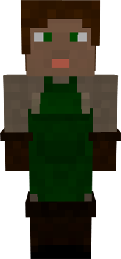

# Composter

&nbsp;&nbsp;&nbsp;

  

    

      
<strong>Primary Trait:</strong>

      
<strong>Secondary Trait:</strong>

      
<strong>Building:</strong>

    

    

      
Dexterity

      
Strength

      
<a href="../buildings/composter">Composter's Hut</a>

    

  

Welcome to the Composter’s Information Site.

The Composter is an addition to help your Farmer(s) get more crops faster. The Composter will turn a lot of items into *compost* using the mod's barrel. So the Deliveryman will give the composter items like: Seeds (all types), saplings (all types), flowers, wheat, carrots, potatoes, beets, etc. Page 2 of the Composter's Hut GUI will show you all the items recognized by the mod that can be used to create compost (including modded materials). Then the composter will use the barrel(s) in it's hut and over some time, turn it into compost that the Deliveryman will then take to the Farmer. The farmer will use the compost just like bonemeal.

Click here for full information about the [Composter's Hut](../../source/buildings/composter) block and using your [Building Tool](../../source/tutorials/building_tool). Once the hut is placed, the Composter will be automatically assigned (or you can manually assign one with the best  [Traits](../../source/tutorials/worker_info) for Composter if you changed this in the setting tab in the [Town Hall's GUI](../../source/buildings/townhall).

You now officially have a Composter! **CONGRATULATIONS!**

Now you will have to issue the builder the “Build” assignment so it can build the “Composter’s Hut”.

**Note:** Once the builder is done you will have to go to page 2 of the hut GUI and "define a list of items to be composted". All recognized items (even modded items) will be listed there. You will have to select from that list waht you want the composter to use to make compost.
