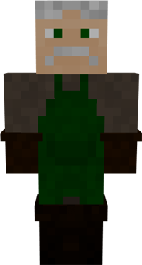

# Composter

&nbsp;&nbsp;

  

    

      
<strong>Primary Trait:</strong>

      
<strong>Secondary Trait:</strong>

      
<strong>Building:</strong>

    

    

      
Stamina

      
Athletics

      
<a href="../buildings/composter">Composter's Hut</a>

    

  

Welcome to the Composter’s Information Site.

The Composter is an addition to help your Farmer(s) get more crops faster and your builder. The Composter will turn a lot of items into *compost* using the mod's barrel. So the Deliveryman will give the composter items like: Seeds (all types), saplings (all types), flowers, wheat, carrots, potatoes, beets, etc. Page 2 of the Composter's Hut GUI will show you all the items recognized by the mod that can be used to create compost (including modded materials). Then the composter will use the barrel(s) in it's hut and over some time, turn it into compost that the Deliveryman will then take to the Farmer. The farmer will use the compost just like bonemeal. The composter can also make dirt in the barrel as well, this is especially useful if you are in an area without dirt.

Click here for full information about the [Composter's Hut](../../source/buildings/composter) block and using your [Building Tool](../items/buildingtool). Once the hut is placed, the Composter will be automatically assigned (or you can manually assign one with the best  [Traits](../systems/workerinfo) for Composter if you changed this in the setting tab in the [Town Hall's GUI](../../source/buildings/townhall).

You now officially have a Composter! **CONGRATULATIONS!**
