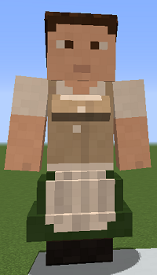

# Cook

&nbsp;&nbsp;&nbsp;

  

    

      
<strong>Primary Trait:</strong>

      
<strong>Secondary Trait:</strong>

      
<strong>Building:</strong>

    

    

      
Adaptability

      
Knowledge

      
<a href="../buildings/restaurant">Restaurant</a>

    

  

Welcome to the Cook’s Information Site.

The Cook is the most important part of the your Colony's food production. The Cook will make steak, pork chops, baked potatoes, cooked fish, etc. to provide for all your workers' food needs. The Cook will be making all of it in the furnace, provided that the [Deliveryman](../workers/deliveryman) (or yourself) give it all the raw ingredients to do it. You can "teach" the cook simple 2 x 2 recipes as well. The Cook will also require **_fuel_** for the furnace, on the second page of the Restauront's Hut blcok, you can select what the cook uses for fuel so the deliveryman will provide it.

Click here for full information about the [Restaurant Hut](../buildings/restaurant) block and using your [Building Tool](../items/buildingtool). Once the hut block is placed and the Cook will be automatically assigned (or you can manually assign one with the best [Traits](../systems/workerinfo) for a Cook if you changed this in the settings tab in the [Town Hall's GUI](../../source/buildings/townhall).

You now officially have a Cook, **CONGRATULATIONS!**

**Hint:** You should think about upgrading the Restaurant so that the worker can make more cooked food at a faster pace.
