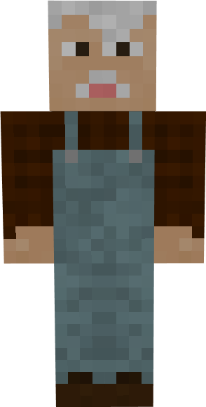
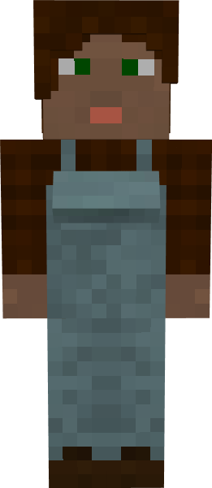

# Cowboy

&nbsp;&nbsp;&nbsp;

  

    

      
<strong>Primary Trait:</strong>

      
<strong>Secondary Trait:</strong>

      
<strong>Building:</strong>

    

    

      
Dexterity

      
Strength

      
<a href="../buildings/cowboy">Cowboy's Hut</a>

    

  

Welcome to the Cowboys's Information Site.

The Cowboy is a crucial part of your Town's needs, not only part of the food production, but also provides you with all drops and by products like; leather and milk. The Cowboy will breed and Butcher the cows for you as long as you provide it with wheat, an axe and a bucket for gathering milk as well.

Click here for full information about the [Cowboy's hut](../../source/buildings/cowboy) block and using your [Building Tool](../items/buildingtool). Once the hut is placed, the Herder will be automatically assigned (or you can manually assign one with the best  "[Traits](../systems/workerinfo)" for a Cowboy if you changed this in the settings tab in the [Town Hall's GUI](../../source/buildings/townhall).

You now officially have a "Cowboy!" **CONGRATULATIONS!**

**NOTE:** The cowboy will not catch and bring in any animal, only breed and butcher the ones in his hut area, so make sure you provide it with 2 initial cows.

The cowboy will currently work with minecraft cows, but might work with some "modded" cows (from other mods), as long as they are *coded* as cow and they have normal breeding behaviour. They will drop anything that is modified by another mod as well, so if another mod changes the drops (f.e.) to include bones or other type of meat the herder will collect these as well.

**Note:** The Cowboy will only keep alive 2 of every kind of animal per hut level, so at level 5 they will have 10 animals in their holding pens alive to breed and butcher. this means they will keep *MORE* and have faster production and collection of meats, drops and by products. So:

| Building Level | Animals "Housed" |
| ----- | ----- |
| 1 | 2 |
| 2 | 4 |
| 3 | 6 |
| 4 | 8 |
| 5 | 10 |

 
