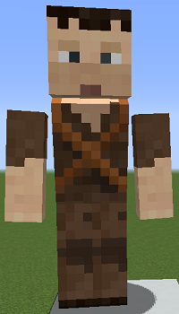
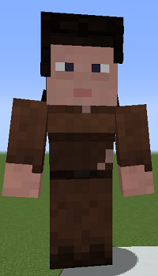

# Deliveryman

&nbsp;&nbsp;&nbsp;

  

    

      
<strong>Primary Trait:</strong>

      
<strong>Secondary Trait:</strong>

      
<strong>Building:</strong>

    

    

      
Agility

      
Adaptability

      
<a href="../buildings/deliveryman">Deliveryman's Hut</a>

    

  

Welcome to the Deliveryman's Information Site.

The Deliveryman is a critial part the bloodline of your Town. It will be running (YES!!! Running) from worker's hut to [Warehouse](../../source/buildings/warehouse) to worker's hut. Visiting all your workers and delivering the tools and materials they need as well as taking the spoils of their works from their chests to the Warehouse and keeps everything centralized. Just make sure to have the tools and materials the workers need inside the warehouse chests for the deliveryman to deliver.

Click here for full information about the [Deliveryman's Hut](../buildings/deliveryman) block and using your [Building Tool](../items/buildingtool). Once the Hut is placed, and the deliveryman will be automatically assigned (or you can manually assign one with the best "[Traits](../systems/workerinfo)" for deliveryman if you changed this in the settings tab in the [Town Hall's GUI](../../source/buildings/townhall).

You now officially have a "Deliveryman!" **CONGRATULATIONS!**

**NOTE:** The level of the Deliveryman's Hut will dictate how much materials/tools it will carry to/from Huts - Warehouse - Huts, so if you want it to carry more materials/tools, be sure to upgrade the [Deliveryman's Hut](../buildings/deliveryman).

Also, the higher the level of the hut, the Deliveryman will move faster and faster back and forth (nice leveling perk, right?).

**Hint**: You MUST build the [Warehouse](../../source/buildings/warehouse) to at least level 1 so the Deliveryman can do it's work. The deliveryman will visit 1 worker's hut per trip, then back to Warehouse. So, level up the Warehouse and build more Deliverymen huts to take care of more worker's huts at the same time and grow grow grow... faster faster faster!

**Note** You can have up to 10 deliverymen per warehouse. The default configuration only allows for 1 warehouse but this can be changed to accommodate more than 1 warehouse. However, the deliverymen assigned to subsequent warehouses will only see the warehouse and the items in the warehouse that they are assigned to.
