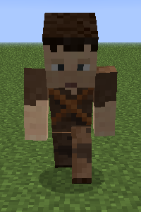

# Deliveryman

Welcome to the Deliveryman's Information Site.

The Deliveryman is the bloodline of your Town. He/she will be running (YES!!! Running) from worker's hut to [Warehouse](../../source/buildings/warehouse) to worker's hut. Visiting all your workers and delivering the tools and materials they need as well as taking the spoils of their works from their chests to the Warehouse and keeps everything centralized. Just make sure to have the tools and materials the workers need inside the warehouse chests for the deliveryman to deliver.

Before you choose a place to build his Hut, take into account the distances among the other buildings and obstacles like water, trees, caves, mountains, lava sources, etc. After you have selected a place for the Hut, you have to craft the Deliveryman's Hut block in the crafting table and use your [Building Tool](../../source/tutorials/building_tool) to place the building. Once you "commit" to the placement of the Deliveryman's Hut, the block will be placed and the deliveryman will be automatically assigned (or you can manually assign one with the best "[Traits](../../source/tutorials/worker_info)" for deliveryman if you changed this in the setting tab in the [Town Hall's GUI](../../source/buildings/townhall).

Best Traits are: **Intelligence** and **Endurance.**

  

You now officially have a "Deliveryman!" **CONGRATULATIONS!**

Now you will have to issue the builder the "Build" assignment so he can build the "Deliveryman's Hut". He will be asking for the materials he/she needs. Make sure to check the "chat" regularly to see what materials the builder is requesting for any build/upgrade.

Hint: If you see the builder has not finished building/upgrading your Deliveryman's hut and you don't see the builder asking for any materials, go to the builder's hut and "recall" the builder and wait a bit to see what the builder needs. Watch the Minecraft "chat" section. Also you can go to page 2 of the builder's hut GUI and check the list of materials required, any material in the list that is still missing will be in red colored letters.

Once the builder is done you can now hire the Deliveryman and the Deliveryman will start to run back and forth from the Warehouse to all the workers huts in your Town. The level of the Deliveryman's Hut will dictate how much materials/tools it will carry to/from Huts - Warehouse - Huts, so if you want it to carry more materials/tools, be sure to upgrade the Deliveryman's Hut.

Also, the higher the level of the hut, the Deliveryman will move faster and faster back and forth (nice leveling perk, right?).

| Building Level |   | Max Stacks of Materials |
| :------------: |:-:| :----------------------:|
| 1 |  | 1 |
| 2 |  | 2 |
| 3 |  | 4 |
| 4 |  | 5 |
| 5 |  | unlimited |

## Hut GUI

Now you can access the Deliveryman's Hut block (right click on it) and you will see a GUI with different options:

  

    
  

  

     
    
The Worker assigned and their Level. (The worker levels up in time by doing their work. The higher the level the faster and more efficient they will be). And the buttons:

    <ul>
      
        <li><strong>{{ item.button }}:</strong> {{ item.content }}</li>
      
    </ul>
  

**Hint**: You MUST build the [Warehouse](../../source/buildings/warehouse) to at least level 1 so the Deliveryman can do his work. Deliveryman will visit 1 worker's hut per trip then back to Warehouse. So, level up the Warehouse and build more Deliveryman huts to take care of more worker's huts at the same time and grow grow grow... faster faster faster!
