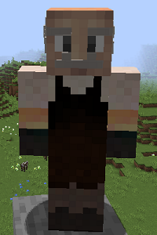
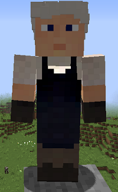

# Dyer

&nbsp;&nbsp;&nbsp;

  

    

      
<strong>Primary Trait:</strong>

      
<strong>Secondary Trait:</strong>

      
<strong>Building:</strong>

    

    

      
Creativity

      
Dexterity

      
<a href="../buildings/dyer">Dyer</a>

    

  

The Dyer is part of the production of the your colony. The Dyer will craft dyes and dyed items. The Dyer will only make these items when they have been taught the recipes, receive a request for an item, and have the needed materials. (The Dyer automatically knows the recipe to make green dye from cacti, however.)

**Note:** The Dyer can only learn a set number of recipes based on their hut level. So:

| Hut Level | Recipes |
| --------- | ------- |
| 1         | 10      |
| 2         | 20      |
| 3         | 40      |
| 4         | 80      |
| 5         | 160     |
