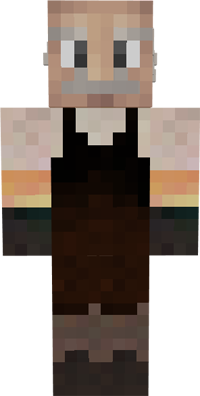

# Dyer

&nbsp;&nbsp;&nbsp;

  

    

      
<strong>Primary Trait:</strong>

      
<strong>Secondary Trait:</strong>

      
<strong>Building:</strong>

    

    

      
Creativity

      
Dexterity

      
<a href="../buildings/dyer">Dyer</a>

    

  

The Dyer is part of the production of the your colony. The Dyer will craft dyes and dyed items.
