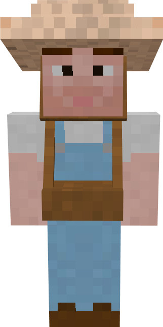

# Farmer

&nbsp;&nbsp;&nbsp;

  

    

      
<strong>Primary Trait:</strong>

      
<strong>Secondary Trait:</strong>

      
<strong>Building:</strong>

    

    

      
Endurance

      
Charisma

      
<a href="../buildings/farm">Farm</a>

    

  

Welcome to the Farmer's Information Site.

The Farmer is the backbone of your food production. The farmer will cultivate the crops you assign it through the "Field" block (Scarecrow).

Click here for full information about the [Farmer's Hut](../buildings/farm) block, the [Field](../buildings/farm) block and using your [Buiding Tool](../items/buildingtool). Once the hut is placed, the farmer will be automatically assigned (or you can manually assign one with the best  "[Traits](../systems/workerinfo)" for farmer if you changed this in the settings tab in the [Town Hall's GUI](../../source/buildings/townhall).

You now officially have a "Farmer!" **CONGRATULATIONS!**

Before the farmer can start, you will have to give the farmer a hoe, the crop you want to cultivate so the farmer can plant, and craft the "Field" block (Scarecrow). Place the "Field" block in the plot of farm land you want the farmer to work on and right click on it to acces it's GUI. Here you will place the crop you want for this specific field to be cultivated. The crops he currently cultivates are: Wheat, carrots, potatoes, beets, melons, pumpkins and most "modded" crops (from other mods) as long as they have normal growth behaviour. Minecraft sugarcane and cactus can be produced by the Florist. (However, cocoa beans are being worked on at the moment).
