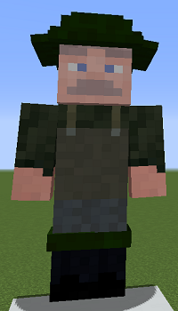

# Fisher

&nbsp;&nbsp;&nbsp;

  

    

      
<strong>Primary Trait:</strong>

      
<strong>Secondary Trait:</strong>

      
<strong>Building:</strong>

    

    

      
Focus

      
Agility

      
<a href="../buildings/fisher">Fisher's Hut</a>

    

  

The Fisher is an important worker for your colony. As long as you provide the Fisher with a fishing rod, the Fisher will provide your colony with everything that can be caught: cod, salmon, pufferfish, tropical fish, junk, and sometimes even TREASURE!

### Note: The Fisher will require a body of water a minimum of 7 x 7 x 1 blocks for them to be able to work, and it must be near their hut.
