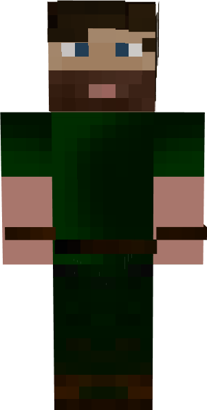
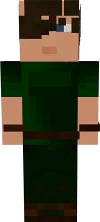

# Fletcher

&nbsp;&nbsp;&nbsp;

  

    

      
<strong>Primary Trait:</strong>

      
<strong>Secondary Trait:</strong>

      
<strong>Building:</strong>

    

    

      
Dexterity

      
Creativity

      
<a href="../buildings/fletcher">Fletcher</a>

    

  

Welcome to the Fletcher’s Information Site.

The Baker is an important part of the supply production of the your Colony. The fletcher will craft bows, fishing poles, wool, paintings and anything else that uses wool or string. 

Click here for full information about the [Fletcher's hut](../buildings/fletcher) block and using your [Building Tool](../items/buildingtool). Once the hut is placed, the Fletcher will be automatically assigned (or you can manually assign one with the best [Traits](../systems/workerinfo) for a Fletcher if you changed this in the setting tab in the [Town Hall's GUI](../../source/buildings/townhall).

You now officially have a Fletcher, **CONGRATULATIONS!**
