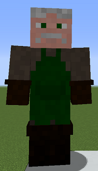
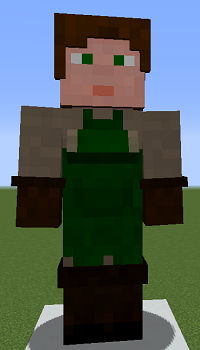

# Florist

&nbsp;&nbsp;&nbsp;

  

    

      
<strong>Primary Trait:</strong>

      
<strong>Secondary Trait:</strong>

      
<strong>Building:</strong>

    

    

      
Dexterity

      
Agility

      
<a href="../buildings/flowershop">Flower Shop</a>

    

  

The Florist is a specialist of your colony's production. The Florist will grow flowers in [compost blocks](../../source/items/compost). For them to do this, they require [compost](../../source/items/compost) and an axe.
