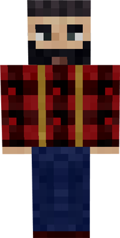

# Forester

&nbsp;&nbsp;&nbsp;

  

    

      
<strong>Primary Trait:</strong>

      
<strong>Secondary Trait:</strong>

      
<strong>Building:</strong>

    

    

      
Strength

      
Focus

      
<a href="../buildings/forester">Forester's Hut</a>

    

  

The Forester is one of the most essential workers in your colony. They will chop trees to provide the wood for all your colony's needs. The Forester will also plant a sapling in the tree's place of the same variety they just chopped down (provided that the tree dropped saplings and the setting is on in the Forester's Hut block GUI). The Forester will only plant a sapling AFTER chopping down a tree. If there are no trees nearby, they will NOT plant any saplings to create a tree.

The higher a Forester's Strength level is, the faster they can break logs. The higher their Focus level, the faster they can walk.

**Hint:** You can remove any trees/saplings and replant any type of sapling in any pattern or shape you need to create a perfect grove for easier access and less walking around, which means more efficient chopping.

**Note:** In Minecraft 1.16+ Foresters require hoes (for breaking leaves).
