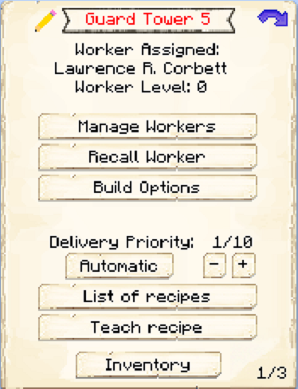
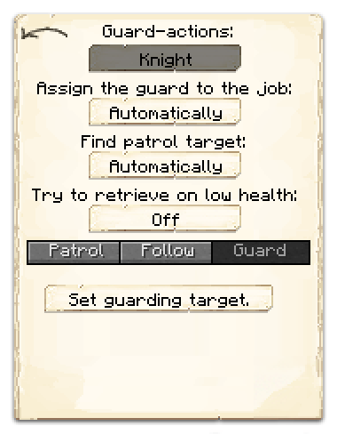

# Guard

  

    

      
<strong>Primary Trait:</strong>

      
<strong>Secondary Trait:</strong>

      
<strong>Building:</strong>

    

    

      
Intelligence

      
Strength

      
<a href="../buildings/guardtower.md">Guard Tower</a> / <a href="../buildings/barracks.md">Barracks</a>

    

  

Welcome to the Guard’s Information Site.

The Guard is the protecting force for your Town. As long as you provide the Guard with a bow and/or a sword (depending on what mode you have set it to), the Guard will protect your Town day and night. Your Guard will also take and use armour you place in the Tower's Hut inventory or in the Guards own inventory.

Before you choose a place to build the Tower, take into account the distances among the other buildings and obstacles like water, trees, caves, mountains, lava sources, etc.

After you have selected a place for the Tower you have to craft the Guard Hut block in the crafting table and use your [Building Tool](../../source/tutorials/building_tool) to place the building. Once you commit to the placement of the Guard's Hut, the block will be placed and the Guard will be automatically assigned (or you can manually assign one with the best [Traits](../../source/tutorials/worker_info) for Guard if you changed this in the setting tab in the [Town Hall's GUI](../../source/buildings/townhall).

You now officially have a Guard, **CONGRATULATIONS!**

Now you will have to issue the builder the “Build” assignment so it can build the “Farmer’s Hut”. It will be asking for the materials it needs. Make sure to check the “chat” regularly to see what materials the builder is requesting for any build/upgrade.

**Hint:** If you see the builder has not finished building/upgrading your Farmer’s hut and you don’t see the builder asking for any materials, go to the builder’s hut and “recall” the builder and wait a bit to see what the builder needs. Watch the Minecraft “chat” section. Also you can go to page 2 of the builder’s hut GUI and check the list of materials required, any material in the list that is still missing will be in red colored letters.

Once the builder is done you can now give the Guard a bow and a sword (depending on what mode you have set it to) and the Guard will start to guard or patrol your Town visiting all your nearby worker huts. The level of the Guard's Tower will dictate how far it can patrol, so if you want a longer patrol range, be sure to upgrade the Guard's Tower.

Now you can access the Guard's Hut block (right click on it) and you will see a GUI with different options:

 

  

    
  

  
  
    
The Worker assigned and it's Level. (The worker levels up in time by doing it's work. The higher the level the faster and more efficient they will be). And the buttons:

    <ul>
      
        <li><strong>{{ item.button }}:</strong> {{ item.content }}</li>
      
    </ul>
  

 

The Guard has 2 Guard modes you can choose from: **Knight** or **Ranger**. BUT... before you can choose any of these two modes you *MUST* change the "Assign the guard to job:" mode from *Automatically* to **Manually**. 

When the Guard is set to <b>Knight</b> mode; the guard will hold a sword.
When the Guard is set to <b>Ranger</b> mode; the guard will use a bow.

This is "page 2" of the GUI. It shows the guard actions you can select: Knight or Ranger (FIRST you have to change the "Assign the guard to the job: to Manually to be able to change the guard actions). Also here you will be able to set (if "Find patrol target: Manually") the way the guard will work: Patrol / Follow / Guard.  And the buttons:

  

       
    
  

  

    <ul>
      <li><strong>Patrol</strong> When you select this mode you have two options: </li>
      <ul>
        <li>If you set "Find patrol target: Automatically", the Guard will patrol from hut to hut and back to his Tower.</li>
        <li>If you set "Find patrol target: Manually", you can set the patrol route when you click on "Set patrol positions". Doing so will spawn a "Guard-scepter" in your inventory. </li>
      </ul>
    </ul>
You can right click using the Guard-scepter to set a single or multiple patrol positions for the Guard to patrol back and forth.
    <ul>
      <li><strong>Follow:</strong> When you select this mode the guard will follow you around wherever you go, as your personal Guard fighting along side you or defending you. If you leave the guard tower more than 40* GuardTower level blocks the guard will automatically return to his tower.</li>
      <li><strong>Guard:</strong> When you select this mode you will receive a "Guard-scepter". You can right click on a block to set it as a guard spot, the guard will stay in that area until his health is low or he has to restock, then he will go the Tower and resupply/regen health and will go back to your designated the guard spot again.</li>
      <li><strong>Knight:</strong> (By default) Here you can define if you want the guard to be a Knight or Ranger.</li>
      <ul>
        <li>Automatically By default. Here you can define if you want the guard to be assigned to Knight or Ranger automatically or Manually.</li>
      </ul>
      <li><strong>Automatically:</strong> (By default) Here you can define if you want the guard to be assigned the patrol target automatically or manually if you want to designate the target(s) for him to patrol.</li>
      <li><strong>Off: </strong> (By default) Here you can define if you want the guard to come back to the Tower on low health to recover his health.</li>
      <li><strong>Patrol / Follow / Guard.-</strong>here you can define how the guard will work.</li>
      <li><strong>Inventory:</strong>This is the most important button. Here you can access the buildings storage from where the “worker” takes and deposits materials, tools and anything he/she finds along the way (citizens will pickup anything in their path that is considered a "drop"; sapling, seeds, rotten flesh, bones, arrows, etc.).</li>
    </ul>
  

  

**Hint:** You can give the Guard an enchanted bow, enchanted sword and enchanted armor as well and reap the benefits of the protection he/she'll be able to provide and the drops the Guard will be picking up along the way.
