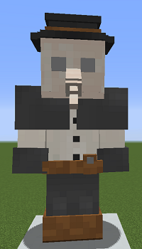

# Healer

&nbsp;&nbsp;&nbsp;

  

    

      
<strong>Primary Trait:</strong>

      
<strong>Secondary Trait:</strong>

      
<strong>Building:</strong>

    

    

      
Intelligence

      
Charisma

      
<a href="../buildings/hospital">Hospital</a>

    

  

Welcome to the Healers's Information Site.

The Healer is another specialist of the your Colony. The Healer will heal your citizens when they become ill, or injured. The Healer will use various items to heal the citizens, provided that the [Deliveryman](../workers/deliveryman) (or yourself) provide needed items to do it.  

Click here for full information about the [Hospital](../buildings/hospital) block and using your [Building Tool](../items/buildingtool). Once the hut is placed, the healer will be automatically assigned (or you can manually assign one with the best [Traits](../systems/workerinfo) for a healer if you changed this in the setting tab in the [Town Hall's GUI](../../source/buildings/townhall).

You now officially have a Healer, **CONGRATULATIONS!**
