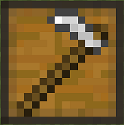

# Herder

Welcome to the Herder's Information Site.

The Herder is a crucial part of your Town's needs, not only the food production, but also provides you with all drops and by products like; leather, feathers, eggs, wool, etc. The Herder will breed and Butcher the animals according to the type of Hut you have placed, for now there are 4 types; the Cowboy (cows), Shepherd (sheep), Swine herder (pigs) and Chicken herder (chickens).

To begin with you have to craft the "Herder Hut" block (of the type of animal you want) in the crafting table and use your [Buiding Tool](../../source/tutorials/building_tool) to place the building. Once you "commit" to the placement of the Herder's hut, the block will be placed and the Herder will be automatically assigned (or you can manually assign one with the best  "[Traits](../../source/tutorials/worker_info)" for Herder if you changed this in the setting tab in the [Town Hall's GUI](../../source/buildings/townhall).

Best Traits are: **Dexterity** and **Strength**.

Ther are 4 type of Herders you can craft and use:

| **Cow Herder (Cowboy)** | **Sheep Herder (Shepherd)** | **Pig Herder (Swine Herder)** | **Chicken Herder (Chicken Herder)** |
|:-:|:-:|:-:|:-:|
| <recipe>cowboy</recipe> | <recipe>shepherd</recipe> | <recipe>swineherder</recipe> | <recipe>chickenherder</recipe> |
|  |  |  |  |
|  |  |  |  |

You now officially have a "Herder!" **CONGRATULATIONS!**

Now you will have to issue the builder the “Build” assignment so it can build the “Herder’s Hut”. It will be asking for the materials it needs. Make sure to check the “chat” regularly to see what materials the builder is requesting for any build/upgrade.

**Hint:** If you see the builder has not finished building/upgrading your Herder’s hut and you don’t see the builder asking for any materials, go to the builder’s hut and “recall” the builder and wait a bit to see what the builder needs. Watch the Minecraft “chat” section. Also you can go to page 2 of the builder’s hut GUI and check the list of materials required, any material in the list that is still missing will be in red colored letters.

Once the builder is done, you will have to capture and bring in 2 of the appropriate animals to the herder's hut. The herder will not catch and bring in any animal, only breed and butcher the ones in his hut area, so make sure you provide it with 2 initial animals of the type of herder you have built (Cows, sheep, pigs or chickens).

The herder will currently work with these 4 type of animals, but might work with some "modded" animals (from other mods), as long as they are *coded* as cow, sheep, pig or chicken and as long as they have normal breeding behaviour. They will drop anything that is modified by another mod as well, so if another mod changes the drops (f.e.) to include bones or other type of meat the herder will collect these as well.

**Note:** The Herder will only keep alive 2 of every kind of animal per hut level, so at level 5 they will have 10 animals in their holding pens alive to breed and butcher. this means they will have *MORE* and faster production and collection of meats, drops and by products. So:

| Building Level | Animals "Housed" |
| ----- | ----- |
| 1 | 2 |
| 2 | 4 |
| 3 | 6 |
| 4 | 8 |
| 5 | 10 |

 

Now you can access the Herder's Hut block (right click on it) and you will see a GUI with different options:

 

  

    
  

  

    
The Worker assigned and it's Level. (The worker levels up in time by doing it's work. The higher the level the faster and more efficient they will be). And the buttons:

    <ul> 
      
        <li><strong>{{ item.button }}:</strong> {{ item.content }}</li>
      
    </ul>
  

  

The **Cowboy** is the *ONLY* type of Herder that has a pg.2 in the Hut GUI. With an option:

 

  

    
  

  

       
    
This is "page 2" of the GUI. It shows one  buttons:

    <ul>
      <li><b>Collecting Milk:</b> By default. In this mode you will have to provide the herder as many empty buckets as you like and in return he will milk the cows and give you back buckets of milk along with the meat and drops.</li>
       
      <li><b>Not Collecting Milk::</b> In this mode, the Herder will not be asking or waiting for buckets, it will jsut breed and butcher the cows and will not collect milk.</li>
    </ul>
  

