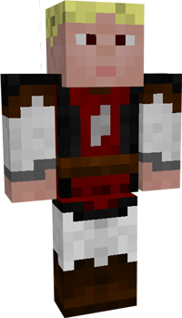

# Knight in Training

  &nbsp;&nbsp;&nbsp;
  &nbsp;&nbsp;&nbsp;

  

    

      
<strong>Primary Trait:</strong>

      
<strong>Secondary Trait:</strong>

      
<strong>Building:</strong>

    

    

      
Adaptability

      
Stamina

      
<a href="../buildings/combatacademy">Combat Academy</a><b>

    

  

The Knight in Training will train at the Combat Academy to become a [Guard](../../source/workers/guard). They will hit a practice dummy with a sword to increase their level without a risk of dying to mobs.

Knights in Training are not actual Guards even though they are dressed in the usual Guard clothes. They will not help defend your colony, only Guards will do that. Knights in Training will also go to their own house at night to sleep.
