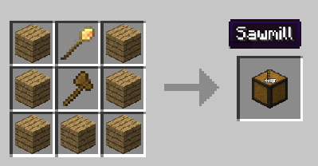
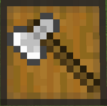
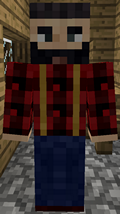

# Lumberjack

The Lumberjack is a very essential worker. Will harvest trees to provide the wood for all your Town needs. Will look for nearby trees and chop them down. Will also plant a sapling in it's place again of the same variety he just chopped down (provided that the tree dropped saplings and/or you provide the Lumberjack with the appropriate saplings). The lumberjack will only plant a sapling AFTER chopping down a tree, if there are no trees nearby, he will NOT plant any saplings to create a tree.
 
Before you choose a place to build the hut, take into account that it has to be near trees or that you personally will have to plant trees close to the hut so the lumberjack can work. After you have selected a place for the hut you have to craft the Lumberjack's Hut block in the crafting table and use your [Buiding Tool](../../source/tutorials/building_tool) to place the building. Once you "commit" to the placement of the Lumberjack's Hut, the block will be placed and the Lumberjack will be automatically assigned (or you can manually assign one with the best "[Traits](../../source/tutorials/worker_info)" for Lumberjack if you changed this in the setting tab in the [Town Hall's GUI](../../source/buildings/townhall). 

Best Traits are: **Strength** and **Charisma**.

 

        

 

You now officially have a "Lumberjack!" **CONGRATULATIONS!**

Now you can give the Lumberjack an axe and it will start to look for trees to chop down right away. You will have to issue the builder the "Build" assignment so the "Lumberjack's Hut" can be built. The lumberjack will be asking for the materials it needs. Make sure to check the "chat" section of Minecraft regularly to see what materials the builder is requesting for any build/upgrade. 

**Note:** Once the builder is done, you can think about upgrading the Lumberjack’s hut to expand the range at which it looks for trees. 

**Hint:** If you see the builder has not finished building/upgrading your Lumberjack's hut and you don't see the builder asking for any materials, go to the builder's hut and "recall' the builder and wait a bit to see what the builder needs. Watch the Minecraft "chat" section. Also you can go to page 2 of the builder's hut GUI and check the list of materials required, any material in the list that is still missing will be in red colored letters. 

## Hut GUI

Now you can access the Lumberjack's Hut block (right click on it) and you will see a GUI with different options:

  

    
  

  

    
The Worker assigned and their Level. (The worker levels up in time by doing their work. The higher the level the faster and more efficient they will be). And the buttons:

    <ul>
      
        <li><strong>{{ item.button }}:</strong> {{ item.content }}</li>
      
    </ul>
  

 

This is “page 2” of the Lumberjack GUI. It shows a list of recognized saplings it can work with. Here you can turn *ON* or *OFF* which type of trees the Lumberjack will chop down and replant. You can then have 1 lumberjack for 2 types of trees (for example). And the buttons:

  

    
  

  

    <ul>  
      <li><strong>Tasklist</strong> Where you can individually select the saplings (tree type) that you want the Lumberjack to work with.</li>   
      <li><strong>Toggle all: </strong>A button so you can just turn <i>ALL</i> saplings (tree types) "On" or "Off" for easier management.</li>
    </ul>
  

 

**Hint:** You can give the Lumberjack an enchanted axe and reap the benefits of the speed that it will be chopping down trees for your Town's needs. Also you can remove any trees/saplings and replant any type of sapling in any pattern or shape you need to create your perfect grove, for easier access and less walking around, which means more chop chop... ;p
