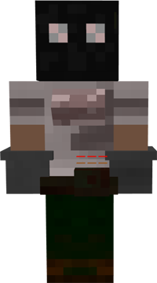

# Mechanic

&nbsp;&nbsp;&nbsp;

  

    

      
<strong>Primary Trait:</strong>

      
<strong>Secondary Trait:</strong>

      
<strong>Building:</strong>

    

    

      
Knowledge

      
Agility

      
<a href="../buildings/mechanic">Mechanic</a>

    

  

The Mechanic is part of the supply production of your colony. The Mechanic will craft redstone items, rails, minecarts, and many other items that no other crafters can make. The Mechanic will only make these items when they have been taught the recipes, receive a request for an item, and have the needed materials.

**Note:** The Mechanic can only learn a set number of recipes based on their hut level. So:

| Hut Level | Recipes |
| --------- | ------- |
| 1         | 10      |
| 2         | 20      |
| 3         | 40      |
| 4         | 80      |
| 5         | 160     |
