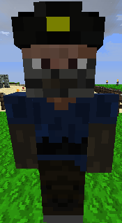

# Miner

&nbsp;&nbsp;&nbsp;

  

    

      
<strong>Primary Trait:</strong>

      
<strong>Secondary Trait:</strong>

      
<strong>Building:</strong>

    

    

      
Strength

      
Stamina

      
<a href="../buildings/mine">Mine</a>

    

  

Welcome to the Miner’s Information Site.

The Miner is the strongest part of your Town. The Miner will dig and create mineshafts, collect; cobblestone, granite, diorite, andesite, dirt, sand, sandstone, etc. as well as all the *ORES* the miner comes across. Important for all the Towns' building needs and crafting tools and weapons for your workers. Any additional modded blocks/ores should also be picked up by the miner if they are properly coded.

Click here for full information about the [Miner's Hut](../buildings/mine) block and using your [Building Tool](../items/buildingtool). Once the hut is placed, the Miner will be automatically assigned (or you can manually assign one with the best [Traits](../systems/workerinfo) for Miner if you changed this in the settings tab in the [Town Hall's GUI](../buildings/townhall).

You now officially have a Miner! **CONGRATULATIONS!**

You will have to give the Miner a pickaxe, a shovel, ladders, planks, slabs, fences/walls, signs, torches and cobblestone. So he can start to build the shaft down to the mining level.

The level of the Miner's Hut will dictate how deep he will create the mine, so if you want the best resources, be sure to upgrade the Miner's Hut. The miner works by digging a shaft down to the depth of the level of his hut, once there he will build a network of random mineshafts branching out from the main shaft looking for the ores. When he finds any ore, he will try and mine out the whole vein, not just what happens to be on his path.

**Hint:** If you see the Miner is not Working and stands by it's hut's block. Check to make sure it has all the materials it needs, specially: cobblestone, pickaxe, shovel and torches. If it's still making the shaft down then make sure it also has; planks, slabs and fences. it might need lots and lots of cobblestone to fill in caves/water/lava/sand/gravel that it finds along the way while making the shaft and/or mining.

**Note:** The miner will only mine blocks according to the level of it's pickaxe. And will only be able to use a tool according to the level of it's hut (check the [Worker's Tool Level](../systems/workerinfo) system). Therefore the miner can only mine Diamonds with an Iron or better pickaxe. When the miner finds water or lava, it will try and block it up and work it's way around it. This could take him some time to do. Mining is a very dangerous profession and the miner might die from lava or being suffocated by Gravel or Sand. The miner will try it's best to be safe. The miner can on occasion get confused and lost. It may start new tunnels and shaft to try and find where he needs to be. Use the Recall Citizen button in the Worker hut GUI to instantly recall the miner to the Miner's Hut block if it gets lost or seems to not bring anything to the Hut block's inventory.

Bonus: The miner also has a chance to get lucky in finding ores when digging out cobblestone or stone.
This is the default setting in the coniguration file.
