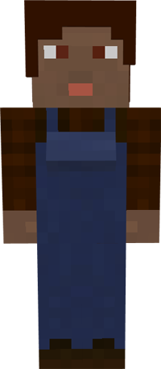

# Planter

&nbsp;&nbsp;&nbsp;

  

    

      
<strong>Primary Trait:</strong>

      
<strong>Secondary Trait:</strong>

      
<strong>Building:</strong>

    

    

      
Agility

      
Dexterity

      
<a href="../buildings/plantation">Plantation</a>

    

  

Welcome to the Planter’s Information Site.

The Planter is an important part of the supply production of the your Colony. The Planter will plant and harvest sugar cane, bamboo, and cactus. 

Click here for full information about the [Plantation's hut](../buildings/plantation) block and using your [Building Tool](../items/buildingtool). Once the hut is placed, the Planter will be automatically assigned (or you can manually assign one with the best [Traits](../systems/workerinfo) for a Planter if you changed this in the setting tab in the [Town Hall's GUI](../../source/buildings/townhall).

You now officially have a Planter, **CONGRATULATIONS!**
